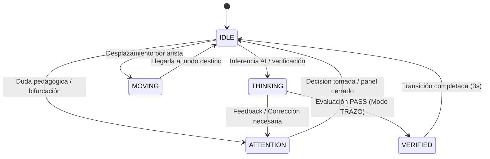

# Análisis Técnico & Especificación Visual 2.5D: Acompañante TRAZO (Mascota)

**Documento:** `analysis.md`  
**Autor:** Explorer 2 (Mascot 2.5D Physical Specs & Visual States)  
**Fecha:** 2026-08-17  
**Estado:** Canónico para la implementación del Acompañante Físico 2.5D  
**Alcance:** Anatomía visual, física de iluminación y sombra, paleta 60-30-10 anti-slop, 5 estados visuales y micro-reacciones.

---

## 1. Misión y Filosofía del Acompañante TRAZO

El Acompañante TRAZO **no es un widget decorativo de chatbot, ni un asistente virtual flotante tipo SaaS, ni una mascota infantil de caricatura, ni un avatar estático**.

Es la **manifestación física viva de la metodología TRAZO** habitando el lienzo cartográfico del Quest Map:
1. **Inhabitación Espacial Real:** Reside físicamente sobre el plano 2.5D del mapa, situado junto al nodo de misión activo, respetando el sistema de coordenadas cartográficas de React Flow (`transform: translate3d`).
2. **Instrumento Cartográfico Táctil:** Su materialidad visual evoca un instrumento de precisión cartográfica (brújula, prisma topográfico, estuche de agrimensura y papel mineral) dibujado con trazo de tinta estructural.
3. **Cero Distracción / Cero Slop:** No emite fuegos artificiales ni gradientes morados SaaS. Sus respuestas son sobrias, útiles, basadas en evidencia y orientadas a desbloquear la siguiente decisión de aprendizaje.

---

## 2. Anatomía Visual 2.5D y Materialidad Física

### 2.1 Dimensiones y Retícula de Construcción
- **Área Interactiva Total (`trazo-companion-root`):** `48px × 48px` (Touch target accesible de `44px × 44px` en el botón central).
- **Cuerpo Físico / Torso (`trazo-figure-torso`):** `32px × 32px`.
- **Relieve 2.5D Proyectado:** El cuerpo presenta una inclinación isométrica sutil (proyección topográfica 2.5D con luz cenital a 45° noroccidental).
- **Geometría de Esquinas:** Radio asimétrico cartográfico de TRAZO (`border-radius: 8px` con opción de `.edge` asimétrico `10px 4px 10px 4px` para coherencia de marca).

```
        ┌─────────────┐
        │   [Antena]  │  <-- Aguja magnética de cobalto (2px x 8px)
        │      ●      │  <-- Gema/Punta sensora (6px)
   ┌────┴─────────────┴────┐
   │ ┌───────────────────┐ │
   │ │   [•]       [•]   │ │  <-- Ojos cartográficos con tracking direccional (3.5px x 5px)
   │ │                   │ │
   │ │        (◎)        │ │  <-- Dial central / Brújula de cobalto (8px x 8px)
   │ └───────────────────┘ │  <-- Torso papel mineral cálido + filete tinta 1.5px
   └───────────┬───────────┘
         ( ( ( ◯ ) ) )        <-- Sombra proyectada desacoplada en el suelo (32px x 10px)
```

### 2.2 Desglose Anatómico por Capas

| Capa | Componente | Dimensiones | Material / Token | Comportamiento Físico |
| :--- | :--- | :--- | :--- | :--- |
| **0 (Suelo)** | Sombra Proyectada | `32px × 10px` | Gradiente radial tinta (`rgba(20, 26, 22, 0.45)` a `0%`) | Desacoplada del cuerpo; se encoge y atenúa cuando el cuerpo flota o salta. |
| **1 (Aura)** | Halo Modo TRAZO | `50px × 50px` | Borde `2px solid #3657FF` + halo difuso de 12px | Inactivo en reposo (`transparent`); se ilumina en estado `verified`. |
| **2 (Torso)** | Chasis Mineral | `32px × 32px` | Papel Mineral Cálido (`--trazo-paper`: `#F1F1EC`), Borde Tinta (`#141A16`) | Caja de resonancia táctil; pulsa suavemente al respirar o procesar. |
| **3 (Óptica)** | Ojos Direccionales | `3.5px × 5px` c/u | Carbono Tinta Puro (`--trazo-ink`) | Se desplazan $\pm 1.5\text{px}$ según las 8 direcciones de la brújula o cursor. |
| **4 (Brújula)** | Dial de Rumbo | `8px × 8px` | Aro Tinta + Aguja Índigo (`--trazo-action`: `#3657FF`) | Gira en dirección a la meta o vibra sutilmente durante el pensamiento. |
| **5 (Antena)** | Mástil & Sensor | Mástil `2×8px`, Punta `6px` | Tinta + Gema Índigo reactiva | Articula inclinación angular ($\pm 15^\circ$) según estado de atención/movimiento. |

---

## 3. Modelo de Iluminación, Profundidad de Sombras y Z-Sorting

### 3.1 Esquema de Iluminación Global
Para mantener la armonía con la cartografía técnica y evitar sombras genéricas de software de diseño:
- **Luz Principal (Key Light):** Luz cenital izquierda (Azimut $315^\circ$, Elevación $45^\circ$).
- **Borde de Resalte Superior:** Filete interno de 1px `inset 0 1px 0 rgba(255, 255, 255, 0.65)` sobre el torso de papel.
- **Línea de Oclusión Inferior:** Borde inferior reforzado con sombra difusa mineral `0 3px 8px rgba(20, 26, 22, 0.12)`.

### 3.2 Cinemática de Sombra Desacoplada
La sombra proyectada (`.trazo-companion-shadow`) reside en un elemento DOM hermano separado del botón del torso, asegurando que la sombra permanezca pegada al plano del suelo mientras el torso realiza bobbing vertical o saltos:

$$\text{Escala de Sombra } (S) = \max\left(0.65, 1.0 - \frac{h_{\text{bobbing}}}{22}\right)$$
$$\text{Opacidad de Sombra } (\alpha) = 0.45 \times S$$

- En elevación máxima ($h = 4\text{px}$): Sombra escala a $0.81\times$ y opacidad a $0.36$.
- En reposo a nivel de suelo ($h = 0\text{px}$): Sombra escala a $1.0\times$ y opacidad a $0.45$.

### 3.3 Dynamic Y-Sorting (Profundidad Cartográfica)
El acompañante se sitúa en el mismo canvas que los nodos de React Flow. Para evitar que atraviese nodos de forma anti-natural o quede oculto detrás de aristas incorrectas:

$$\text{z-Index} = \left\lfloor \frac{Y_{\text{pos}}}{10} \right\rfloor + 15$$

Garantiza que al descender por el mapa ($Y$ creciente), el acompañante se sobreponga visualmente a los elementos que quedan más al norte (arriba).

---

## 4. Paleta de Color (Regla Estricta 60-30-10) y Anti-Slop

### 4.1 Distribución Proporcional de Color

```
┌──────────────────────────────────────────────────────────────────────────┐
│ 60% DOMINANTE: Papel Mineral Cálido (#F1F1EC / #F3EEE2)                  │
│ [Superficie del cuerpo, fondo del mapa, base del diálogo]                │
├────────────────────────────────────────┬─────────────────────────────────┤
│ 30% ESTRUCTURAL: Tinta Carbón (#141A16)│ 10% ACENTO: Cobalto (#3657FF)   │
│ [Filetes 1.5px, ojos, antena, sombra]  │ [Gema sensor, aguja, modo TRAZO]│
└────────────────────────────────────────┴─────────────────────────────────┘
```

| Categoría | Token CSS | Valor Hex / RGBA | Aplicación en la Mascota |
| :--- | :--- | :--- | :--- |
| **60% Dominante** | `--trazo-paper` | `#F1F1EC` (`#F3EEE2`) | Superficie sólida del torso, fondo de viñetas y burbujas de diálogo. |
| **30% Estructural** | `--trazo-ink` | `#141A16` | Contornos técnicos de 1.5px, ojos, mástil de antena, sombra de suelo. |
| **10% Acento** | `--trazo-action` | `#3657FF` (`#2625B7`) | Aguja de rumbo, gema de la antena activa, halo y estela del Modo TRAZO. |
| **Auxiliar Estado** | `--trazo-stone` | `#8E938B` | Bisel de la brújula en reposo, indicador inactivo. |

### 4.2 Verificación de Anti-Slop (Auditoría de Clichés Erradicados)

| Cliché Prohibido (Anti-Slop) | Decisión de Diseño en el Acompañante TRAZO |
| :--- | :--- |
| ❌ Gradientes morados/púrpuras sobre dark mode | ✅ Cero púrpura. Paleta de papel mineral cálido y tinta carbón con cobalto de alta precisión. |
| ❌ Ojos de emoji o estilo Pixar hiper-emotivo | ✅ Ojos geométricos de hendidura cartográfica (`3.5px × 5px`) con movimiento de cuadrantes sobrio. |
| ❌ Badges tipo "✨ AI Assistant" o "Smart Bot" | ✅ Etiqueta cartográfica mínima: "Acompañante TRAZO" con roles de decisión claros. |
| ❌ Efecto Glassmorphism / desenfoque excesivo | ✅ Superficie táctil opaca con bordes nítidos de 1.5px y contraste APCA verificado (>7:1). |
| ❌ Partículas flotantes o estelas de brillo exagerado | ✅ Estela discreta de puntos de agrimensura y waypoints de cobalto que se disipan en 600ms. |

---

## 5. Especificación Exhaustiva de los 5 Estados Visuales



---

### Estado 1: `IDLE` (Reposo Cartográfico)

```
       │  (Antena recta, punta tinta)
    ┌──┴──┐
    │ • • │  (Mirada centrada o paneo lento)
    │ (·) │  (Brújula en reposo)
    └─────┘
    (  ◯  )  (Respiración suave 3.4s)
```

- **Propósito:** Presencia viva sin saturar la atención del usuario mientras estudia el mapa.
- **Posicionamiento:** Anclado a una distancia offset fija del nodo activo: $(X_{\text{nodo}} + 48\text{px}, Y_{\text{nodo}} - 12\text{px})$.
- **Anatomía Visual:**
  - Torso: Papel mineral `#F1F1EC`, borde `#141A16`.
  - Antena: Vertical $0^\circ$, gema en color tinta neutro (`#141A16`).
  - Ojos: Posición neutra central.
  - Brújula: Aguja estática apuntando al norte topográfico.
- **Cinemática:**
  - Ciclo de respiración armónica de `3.4s` mediante `@keyframes trazo-idle-breathe` (`translateY(0) -> translateY(-1.8px) -> translateY(0)`).
  - Sombra oscila en escala de `1.0 -> 0.92 -> 1.0` en sincronía con la respiración.
- **Nivel de Ruido:** 0% sonido, 0% partículas, mínima actividad de GPU.

---

### Estado 2: `ATTENTION` (Escucha y Orientación Focalizada)

```
        /   (Antena inclinada +15°, punta COBALTO)
    ┌──┴──┐
    │ ◕ ◕ │ (Ojos orientados hacia el punto de interés)
    │ (↗) │ (Aguja orientada)
    └─────┘
   [Tengo una duda]  <-- Píldora de tinta emergente (sin abrir chat)
```

- **Propósito:** Indicar de forma visible pero no intrusiva que TRAZO tiene una recomendación de ruta o requiere una clarificación metodológica para continuar.
- **Activación:** 
  - `proposal.type === 'ASK_CLARIFICATION'` (pregunta de desempate pedagógico).
  - `proposal.type === 'RECOMMEND_MISSION'` (sugerencia de bifurcación óptima).
- **Anatomía Visual:**
  - Antena: Se articula con un chasquido elástico a $+15^\circ$ en dirección a la ruta sugerida.
  - Gema del Sensor: Se ilumina en Cobalto de Acción (`#3657FF`).
  - Ojos: Se ensanchan $+0.5\text{px}$ y se orientan hacia la dirección recomendada.
  - Píldora Periférica (`.trazo-attention-pill`): Etiqueta en tinta carbón (`#141A16`) con texto en papel (`#F1F1EC`): *"Tengo una duda"* o *"Vamos por aquí"*.
- **Cinemática:**
  - Entrada de la píldora con micro-pop (`trazo-attention-pop` en `250ms cubic-bezier(0.16, 1, 0.3, 1)`).
  - El panel de conversación **NO se abre automáticamente**, respetando la regla de no interrumpir al usuario.

---

### Estado 3: `THINKING` (Pulsación Mecánica / Inferencia AI)

```
      \ ~ /  (Antena oscila -12° a +12° armónicamente)
    ┌──┴──┐
    │ • • │  (Ojos en concentración)
    │ (~) │  (Dial en micropulsación táctil 1.2s)
    └─────┘
```

- **Propósito:** Retroalimentación visual continua durante la inferencia asíncrona de Gemini o el análisis de evidencias, **erradicando spinners circulares genéricos de SaaS**.
- **Activación:** `isEvaluating === true` o `isLoading === true`.
- **Anatomía Visual:**
  - Antena: Oscilación angular armónica entre $-12^\circ$ y $+12^\circ$ con periodo de `1.2s` (`@keyframes trazo-thinking-antenna`).
  - Gema del Sensor: Emite una pulsación de luminancia suave (sin sobre-exposición ni glow masivo).
  - Dial Central: La aguja de la brújula oscila rítmicamente $\pm 18^\circ$ simulando calibración de rumbo.
  - Torso: Tinte tenue de cobalto al 8% sobre el papel mineral.
- **Cinemática:** Ciclo armónico continuo desacoplado de React para no provocar re-renders.

---

### Estado 4: `MOVING` (Desplazamiento Cinemático por Aristas SVG)

```
      ═══► (Inclinación 6° en dirección del vector de avance)
    ┌──┴──┐
    │»  » │ (Ojos adelantados en vector de avance)
    │ (►) │ (Aguja de rumbo alineada con la tangente)
    └─────┘
    •  •  •  <-- Estela tenue de waypoints topográficos
```

- **Propósito:** Travesía física a lo largo de las aristas del grafo (`QuestEdge`), reforzando la progresión espacial del estudiante.
- **Mapeo de 8 Direcciones (`data-direction`):**

| Dirección | Vector Tangente ($\theta$) | Desplazamiento de Ojos | Inclinación de Torso |
| :--- | :--- | :--- | :--- |
| **`E` (Este)** | $-22.5^\circ \text{ a } +22.5^\circ$ | `translateX(1.5px)` | `rotate(0deg) skewY(2deg)` |
| **`SE` (Sureste)**| $+22.5^\circ \text{ a } +67.5^\circ$ | `translate(1px, 1px)` | `rotate(4deg)` |
| **`S` (Sur)** | $+67.5^\circ \text{ a } +112.5^\circ$ | `translateY(1.5px)` | `scaleY(0.96) translateY(1px)` |
| **`SW` (Suroeste)**| $+112.5^\circ \text{ a } +157.5^\circ$| `translate(-1px, 1px)` | `rotate(-4deg)` |
| **`W` (Oeste)** | $+157.5^\circ \text{ a } -157.5^\circ$| `translateX(-1.5px)` | `rotate(0deg) skewY(-2deg)` |
| **`NW` (Noroeste)**| $-157.5^\circ \text{ a } -112.5^\circ$| `translate(-1px, -1px)` | `rotate(-4deg)` |
| **`N` (Norte)** | $-112.5^\circ \text{ a } -67.5^\circ$ | `translateY(-1.5px)` | `scaleY(1.04) translateY(-1px)` |
| **`NE` (Noreste)**| $-67.5^\circ \text{ a } -22.5^\circ$ | `translate(1px, -1px)` | `rotate(4deg)` |

- **Cinemática de Viaje:**
  - **Velocidad Tangencial Constante:** $220\text{ px/s}$ calculada mediante longitud de arco real sobre la curva Bézier / polilínea ortogonal SVG (`CompanionPathSampler`).
  - **Bobbing de Pisada:** Onda senoidal con frecuencia acoplada a la distancia ($h_{\text{bob}} = |\sin(\text{progreso} \times 8\pi)| \times 3.5\text{px}$).
  - **Squash & Stretch Físico:** En aceleraciones y curvas, el torso aplica una escala proporcional $1.04\times$ en el eje longitudinal y $0.96\times$ en el transversal.
  - **Estela Cartográfica:** Se depositan micro-pips de tinta (`2px × 2px`) en los vértices del camino que se desvanecen en $600\text{ms}$.

---

### Estado 5: `VERIFIED` / Modo TRAZO (Triunfo y Sello de Verificación)

```
        ★   (Punta sensor en cobalto puro brillante)
     ╭─────╮ (Halo de cobalto activado: 2px solid #3657FF)
   ┌─┴─────┴─┐
   │  ^   ^  │ (Ojos en expresión de satisfacción certera)
   │   (★)   │ (Dial en cobalto pleno)
   └───┬─┬───┘
     ( (◯) )  (Salto de triunfo 8px + asentimiento firme)
   "yep. eso sí" <-- Sello de validación
```

- **Propósito:** Celebrar la validación genuina de una misión (evaluación PASS) con una confirmación sobria, satisfactoria y técnica ("yep. eso sí").
- **Activación:** `isVerifiedAction === true` tras recibir dictamen `PASS` del evaluador.
- **Anatomía Visual:**
  - Halo Perimetral (`.trazo-companion-halo`): Se enciende con borde `2px solid var(--trazo-action)` y resplandor cobalto contenido (`box-shadow: 0 0 12px rgba(54, 87, 255, 0.35)`).
  - Superficie del Torso: Transiciona a tinte periwinkle mineral (`color-mix(in srgb, #3657FF 12%, #F1F1EC)`).
  - Borde Estructural: Pasa de tinta carbón a cobalto de alta pureza.
  - Dial y Antena: Ambos brillan en cobalto pleno.
- **Cinemática de Triunfo:**
  - Salto elástico vertical de $8\text{px}$ en `300ms` seguido de un asentimiento físico de cartógrafo ($+4^\circ$ tilt hacia abajo).
  - La arista saliente y el nodo completado se iluminan en cobalto sólido.
  - Persistencia de `2.8s` antes de regresar suavemente a `IDLE`.

---

## 6. Especificación de Micro-Reacciones

Las micro-reacciones dotan de vida táctil al acompañante sin interferir con la productividad del usuario:

| Micro-Reacción | Evento Disparador | Respuesta Visual & Kinemática | Duración |
| :--- | :--- | :--- | :--- |
| **Seguimiento Ocular (Hover Tracking)** | Cursor se aproxima a $<80\text{px}$ del acompañante | Los ojos se orientan suavemente hacia el vector del cursor ($\pm 1.5\text{px}$). | Dinámica continua |
| **Toque Rápido Repetido (Multi-Tap)** | $\ge 3$ clics en $<350\text{ms}$ sobre el cuerpo | Aplastamiento físico elástico ($0.90\times$ altura) y burbuja de diálogo sobria: *"¡Oye! Estoy aquí concentrado jaja"*. | `2.4s` |
| **Clic Simple en Nodo Lejano** | Usuario selecciona un nodo desbloqueado | El acompañante orienta su cuerpo y antena hacia el nodo antes de iniciar la travesía. | `150ms` pre-travel |
| **Error / Advertencia en Evidencia** | Dictamen `FAIL` o advertencia de requisitos | Antena cae $-8^\circ$, la aguja apunta abajo y el torso muestra una leve vibración de desaprobación ($2\text{px}$ horizontal). | `400ms` |
| **Inactividad Prolongada (Idle > 60s)** | Sin interacción de ratón/teclado durante 60 segundos | El cuerpo desciende $2\text{px}$ más cerca del suelo, respiración se ralentiza a `4.8s` (modo cartógrafo en vigilia). | Hasta nueva acción |

---

## 7. Panel Compacto Anclado (`trazo-anchored-panel`)

Cuando el usuario hace clic simple sobre el acompañante, se despliega el panel de diálogo anclado:
- **Anclaje Físico:** Posicionado a `top: 52px`, centrado bajo el sprite del acompañante (`transform: translateX(-50%)`).
- **Dimensiones:** Ancho fijo `320px` (máximo `85vw` en pantallas compactas).
- **Jerarquía Visual:**
  - Cabecera: Papel cálido `#F1F1EC`, título `Anton` de 0.85rem, badge `Geist` bold "ACOMPAÑANTE", botón de cierre táctil.
  - Cuerpo: Conversación secuencial de decisiones (máximo 6 turnos), preguntas de clarificación con input integrado y CTA primario índigo `.edge` (*"Ir a esta ruta →"*).
- **Regla Fundamental:** El panel es **modal contextual ligero**; no bloquea el resto del lienzo y se cierra al hacer clic fuera o al iniciar una misión.

---

## 8. Accesibilidad y Modo de Movimiento Reducido (`prefers-reduced-motion`)

1. **Desactivación Completa de Bucles:**
   ```css
   @media (prefers-reduced-motion: reduce) {
     .trazo-companion-root,
     .trazo-companion-figure,
     .trazo-figure-antenna,
     .trazo-figure-torso,
     .trazo-eye,
     .trazo-attention-pill,
     .trazo-anchored-panel {
       animation: none !important;
       transition: none !important;
     }
   }
   ```
2. **Teletransportación Instantánea con Cross-Fade:** En modo de movimiento reducido, el gancho `useCompanionTraveler` omite la interpolación frame a frame y ejecuta `teleportTo()` inmediatamente, aplicando un sutil cross-fade de opacidad de $150\text{ms}$.
3. **Anuncios para Lectores de Pantalla:** El sprite físico mantiene `aria-hidden="true"` para evitar ruido en navegación de pantalla, mientras que los cambios críticos de estado (como activación de Modo TRAZO o emisión de clarificaciones) se notifican mediante una región viva `aria-live="polite"`.
