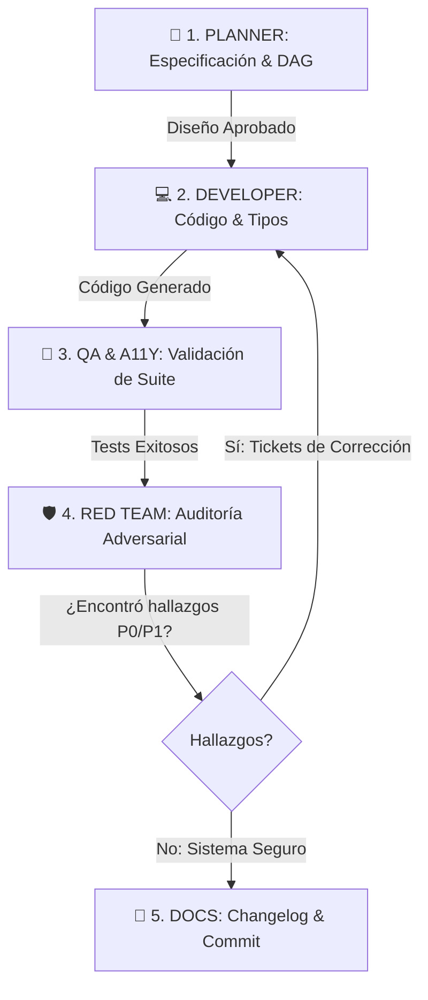

# Multi-Agent Architecture & Team Playbook

Este repositorio opera bajo una arquitectura de **Equipo Multi-Agente Agnóstico del Proveedor**. Cualquier asistente o entorno de desarrollo (Google Antigravity, OpenAI Codex, OpenCode, Cursor o scripts CLI) que interactúe con este código debe seguir los roles, la matriz de modelos y el protocolo de ejecución definidos en este documento.

---

## 1. Matriz de Tiers, Modelos y Cuotas

Para maximizar la velocidad y aprovechar al máximo las cuotas disponibles sin generar costos innecesarios, se define una estrategia de 3 niveles con **cero dependencia de Claude**:

```
                     ┌─────────────────────────────────────────────────────────┐
                     │ 👑 0. ORQUESTADOR (Hub Central)                         │
                     │ Antigravity (Gemini 3.7 Flash) ó Codex (GPT-5.6 Luna)   │
                     └──────────────┬────────────────────────────┬─────────────┘
                                    │                            │
             ┌──────────────────────┴──────┐              ┌──────┴─────────────────────┐
             ▼                             ▼              ▼                            ▼
   🎯 1. PLANNER / ARCHITECT     💻 2. DEVELOPER      🛡️ 3. RED TEAM (Auditor)    🧪 4. QA & A11Y
   GPT-5.6 Terra / NIM GLM-5.2   Gemini 3.7 Flash     DeepSeek V4 Flash (Free)     MiMo V2.5 (Free)
   (Crítico: GPT-5.6 Sol)        GPT-5.6 Luna         Nemotron Ultra (NIM)         Gemini 3.7 Flash
```

| Nivel | Modelos Asignados | Propósito y Política de Cuota |
| :--- | :--- | :--- |
| **🟢 Tier 0 (Free / Alta Cuota)** | • **Gemini 3.7 Flash** (Antigravity)<br>• **DeepSeek V4 Flash Free** (Open Zen)<br>• **MiMo V2.5 Free** (Open Zen) | **Caballo de batalla diario (80% del trabajo).** Gemini 3.7 Flash aprovecha la mayor cuota y máxima inteligencia (~61) para el desarrollo continuo. Open Zen Free se reserva exclusivamente para revisiones y Red Team sin sesgo de proveedor. |
| **🟡 Tier 1 (Pro / Precisión)** | • **GPT-5.6 Terra** (OpenAI)<br>• **GPT-5.6 Luna** (OpenAI)<br>• **GLM-5.2 / Nemotron Ultra** (NVIDIA NIM) | **Arquitectura y tareas de alta precisión.** Luna ($0.05) para tareas rápidas y tipado; Terra y GLM-5.2 para decisiones arquitectónicas y diseño de contratos. |
| **🔴 Tier 2 (Nuclear / Emergencia)** | • **GPT-5.6 Sol** (OpenAI) | **Uso quirúrgico exclusivo.** Reservado para desbloqueo de bugs arquitectónicos críticos o auditoría final antes de un release mayor. |

---

## 2. Definición de Roles del Equipo

### 👑 0. Orquestador (`orchestrator`)
* **Responsabilidad:** Analiza los requerimientos del usuario, selecciona el Tier de ejecución, despacha tareas a los especialistas en el orden correcto y sintetiza los resultados.
* **Skill Asociada:** [`.agents/skills/orchestrator/SKILL.md`](file:///c:/Proyectos/acompa%C3%B1ante%20de%20ia/.agents/skills/orchestrator/SKILL.md)
* **Regla de Oro:** No ejecuta cambios destructivos sin previa validación.

### 🎯 1. Planner / Arquitecto (`planner-architect`)
* **Responsabilidad:** Diseña estructuras de datos, define el DAG de progresión educativa (cursos, capítulos, misiones, dependencias) y especifica contratos técnicos antes de programar.
* **Skill Asociada:** [`.agents/skills/ux-architecture/SKILL.md`](file:///c:/Proyectos/acompa%C3%B1ante%20de%20ia/.agents/skills/ux-architecture/SKILL.md)

### 💻 2. Developer (`developer`)
* **Responsabilidad:** Implementa componentes modulares en React 19 + TypeScript + `@xyflow/react`, siguiendo los principios visuales de [`DESIGN.md`](file:///c:/Proyectos/acompa%C3%B1ante%20de%20ia/DESIGN.md).
* **Skill Asociada:** [`.agents/skills/frontend-implementation/SKILL.md`](file:///c:/Proyectos/acompa%C3%B1ante%20de%20ia/.agents/skills/frontend-implementation/SKILL.md)

### 🛡️ 3. Red Team / Auditor Adversarial (`red-team`)
* **Responsabilidad:** Audita código y arquitectura buscando vulnerabilidades, inyecciones de prompts indirectas, fallas de validación, envenenamiento de estado y edge cases lógicos.
* **Skill Asociada:** [`.agents/skills/red-team/SKILL.md`](file:///c:/Proyectos/acompa%C3%B1ante%20de%20ia/.agents/skills/red-team/SKILL.md)
* **Regla de Oro:** **Siempre debe ser ejecutado por un modelo de familia distinta al Developer** (ej. si el Developer fue Gemini, el Red Team debe ser DeepSeek Free o GPT Terra) para evitar el sesgo de confirmación.

### 🧪 4. Tester, QA & Accesibilidad (`tester-qa`)
* **Responsabilidad:** Ejecuta linters, suites de tests (Playwright), audita la accesibilidad funcional (a11y, foco, teclado, contraste) y evalúa la calidad visual contra el "anti-slop".
* **Skills Asociadas:** [`.agents/skills/accessibility/SKILL.md`](file:///c:/Proyectos/acompa%C3%B1ante%20de%20ia/.agents/skills/accessibility/SKILL.md) y [`.agents/skills/design-critique/SKILL.md`](file:///c:/Proyectos/acompa%C3%B1ante%20de%20ia/.agents/skills/design-critique/SKILL.md)

### 📝 5. Docs & Changelog (`docs-changelog`)
* **Responsabilidad:** Mantiene actualizadas las especificaciones técnicas, registra commits semánticos y actualiza el historial de cambios.

---

## 3. Protocolo del Bucle Continuo (5 Fases)

Cada feature, cambio estructural o refactorización debe seguir este flujo iterativo:



1. **Fase 1 (Planner):** Produce el plan de ejecución y contratos de tipos.
2. **Fase 2 (Developer):** Escribe el código modular y tipado.
3. **Fase 3 (QA & a11y):** Ejecuta `npm run typecheck`, verifica navegación por teclado y contraste.
4. **Fase 4 (Red Team):** Prueba inyecciones indirectas en inputs/payloads, mutaciones ilegales de estado y emite tickets P0–P3. Si hay fallos críticos, el Developer los resuelve antes de cerrar la tarea.
5. **Fase 5 (Docs):** Registra el changelog y finaliza el ciclo.

---

## 4. Configuración Agnóstica de Proveedores

Los perfiles de ejecución y modelos activos se configuran en [`.pipeline/config.json`](file:///c:/Proyectos/acompa%C3%B1ante%20de%20ia/.pipeline/config.json).
Cualquier script o wrapper CLI debe consultar ese archivo para resolver los endpoints y modelos actuales.

---

## 5. Protocolo de Invocación CLI (Router Pipeline)

Cualquier modelo o asistente que necesite invocar a los especialistas CLI debe respetar las siguientes directrices técnicas para evitar bloqueos por `stdin` en entornos Windows/PowerShell:

### ⚠️ Regla Crítica de Stdin en Windows
Los binarios de `codex exec` y `opencode run` leen por defecto del flujo estándar de entrada (`stdin`). Si se ejecutan sin redirección, el proceso se quedará esperando indefinidamente (`Reading additional input from stdin...`).
* **En PowerShell / Terminal:** Siempre canalizar un cierre de entrada:  
  `echo "" | codex exec ...` o `echo "" | opencode run ...`
* **En Scripts de Python:** Siempre pasar `input=""` y `shell=True` en `subprocess.run()`.
* **Vía Router Automatizado:** Ejecutar `python .pipeline/audit.py --role <planner|red_team|tester|all> --prompt "..."`.

### Comandos Canónicos de Invocación

| Rol / Especialista | Proveedor | Comando Canónico CLI |
| :--- | :--- | :--- |
| **🎯 1. Planner / Architect** | **OpenAI Codex** | `echo "" \| codex exec --sandbox read-only -m gpt-5.6-luna "<prompt>"` |
| **🛡️ 3. Red Team Auditor** | **OpenCode Zen** | `echo "" \| opencode run -m opencode/deepseek-v4-flash-free "<prompt>"` |
| **🧪 4. Tester / QA** | **OpenCode Zen** | `echo "" \| opencode run -m opencode/mimo-v2.5-free "<prompt>"` |
| **🛡️ 3. Red Team (Tier 2 NIM)** | **NVIDIA NIM / OpenCode** | `echo "" \| opencode run -m nvidia/z-ai/glm-5.2 "<prompt>"` |

