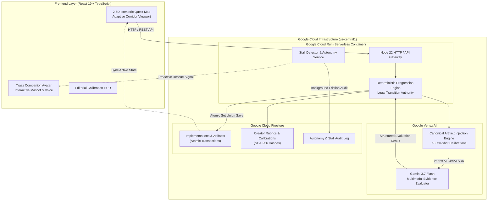

# TRAZO — Autonomous Agentic Progression Platform

> **Submitted to the Google Cloud "All Things Agentic" Global Hackathon**  
> **Track:** *The Collaborative Partner*  
> **Live Production URL:** [https://trazo-759796956692.us-central1.run.app](https://trazo-759796956692.us-central1.run.app)  
> **Target Models & Infrastructure:** Google Vertex AI (`gemini-3.7-flash`), Google Cloud Run, Cloud Firestore.

---

## 1. Executive Summary & Problem Statement

Online education suffers from a catastrophic **96% average drop-off rate**—a reality documented by landmark Harvard and MIT research published in *Science*. Traditional static platforms treat all students identically: when a learner encounters friction or ambiguity, they are left with passive video libraries or hallucinating chat wrappers that cannot enforce real-world mastery.

**TRAZO** is an autonomous, stateful agentic learning platform that transforms educational methodologies into an interactive, dynamic 2.5D quest map. Built on **Google Vertex AI** (`gemini-3.7-flash`), **Google GenAI SDK**, **Google Cloud Run**, and **Google Cloud Firestore**, TRAZO introduces:

1. **Autonomous Rubric Evaluation & Graph Mutation:** Submissions are evaluated against creator rubrics on Vertex AI; verified deliverables (`PASS`) immediately trigger real-time DAG graph transitions and unlock branched corridors.
2. **Consequential Downstream Artifact Chaining:** Deliverables approved in upstream missions become canonical constraints injected into downstream evaluation prompts.
3. **Proactive Autonomous Friction Rescue:** A background autonomy monitor detects repeated learner struggle (`2x REWORK`) and intervenes proactively with adaptive guidance—without the user needing to ask for help.
4. **Non-Sycophantic Feedback Policy:** The companion never flatters or cheats progress forward; only verified evidence unlocks consequential milestones.
5. **Creator Calibration Cockpit:** Course creators calibrate Gemini against synthetic and real-world edge cases with cryptographic SHA-256 rubric versioning.

---

## 2. Technical Architecture & Google Cloud Integration



---

## 3. Core Agentic Innovations

### A. The Collaborative Partner vs. Generic Chatbot
* **Stateful Memory Across Multi-Turn Milestones:** Unlike single-turn chatbots, TRAZO maintains a persistent, immutable identity and progression record in Cloud Firestore.
* **Deterministic Policy Gate:** Gemini interprets qualitative evidence and suggests verdicts, but the deterministic backend enforces strict prerequisites. A `REWORK` or error verdict can **never** illegally advance the progression graph.

### B. Consequential Artifact Downstream Chaining
* When a student passes Mission `C01` (*"Define your high-ticket offer"*), the backend generates a canonical `offer` artifact.
* When evaluating Mission `C02` (*"Select 5 target clients"*), Gemini is supplied with the verified `offer` artifact inside `<trusted_context>`. If the student targets contradictory profiles, Gemini flags `c1_offer_alignment` as `NOT_MET` and requests targeted rework.

### C. Proactive Background Stall Detection (H01 / H02)
* The system actively monitors evaluation provenance. If an active learner receives 2 consecutive `REWORK` verdicts on the same mission, the **Autonomy Service** triggers an autonomous rescue event:
  - Trazz’s avatar activates a cobalt pulse.
  - A contextual friction card appears directly on the submission panel highlighting the exact rubric criterion requiring refinement.

### D. Creator Few-Shot Calibration Cockpit
* Coaches specify natural language transformation goals and upload sample submissions.
* Gemini generates synthetic edge cases (PASS, REWORK, and boundary cases).
* Once approved, the calibrated prompt is assigned an immutable SHA-256 hash and used as the gold standard for cohort evaluation.

---

## 4. Technology Stack

* **AI & LLMs:** Google Vertex AI (`gemini-3.7-flash`), Google GenAI SDK (`@google/genai` & `@google-cloud/vertexai`).
* **Cloud Infrastructure:** Google Cloud Run (Fully Managed Serverless Container), Cloud Build, Google Cloud Firestore.
* **Backend:** Node.js 22 (Native TypeScript Strip-Types), Atomic Firestore Transactions.
* **Frontend:** React 19, TypeScript, CSS Variables Design System (APCA-validated color contrast, 60-30-10 palette).
* **Testing & Quality Assurance:** Playwright E2E Browser Testing, Vitest/Node Test Runner (220+ automated unit & integration tests).

---

## 5. Local Setup & Spin-Up Instructions

### Prerequisites
* **Node.js:** v22.0.0 or higher
* **Google Cloud SDK (`gcloud`):** Authenticated with Application Default Credentials (ADC)
* **GCP Project:** `trazo-agentic-2026` with Vertex AI and Firestore APIs enabled.

### 1. Clone & Install Dependencies
```bash
git clone https://github.com/your-org/trazo-agentic.git
cd trazo-agentic
npm install
```

### 2. Configure Environment Variables
Create a `.env` file in the root directory:
```ini
NODE_ENV=development
PORT=3001
GCP_PROJECT_ID=trazo-agentic-2026
GCP_LOCATION=us-central1
VERTEX_AI_MODEL=gemini-3.7-flash
TRAZO_ACTIVE_PACK=primer-sistema-de-contenido
```

### 3. Authenticate with Google Cloud ADC
```bash
gcloud auth application-default login
```

### 4. Run Development Servers
```bash
# Start backend API server
npm run server

# In a separate terminal, start frontend dev server
npm run dev
```
Navigate to `http://localhost:5173`.

---

## 6. Running Automated Verification Suites

```bash
# Static type verification (Zero TypeScript errors)
npm run typecheck

# Full Unit & Domain Contract Test Suite (222+ passing tests)
npm test

# Full End-to-End Playwright Browser Automation Suite
npx playwright test
```

---

## 7. Production Deployment (Google Cloud Run)

To deploy the production-ready monolithic container to Google Cloud Run:

```bash
gcloud run deploy trazo \
  --source . \
  --region us-central1 \
  --allow-unauthenticated \
  --set-env-vars NODE_ENV=production,PORT=8080,STORAGE_BACKEND=firestore,GOOGLE_CLOUD_PROJECT=trazo-agentic-2026,GCP_PROJECT_ID=trazo-agentic-2026,GCP_LOCATION=us-central1,VERTEX_AI_MODEL=gemini-3.7-flash,TRAZO_ACTIVE_PACK=primer-sistema-de-contenido
```

---

## 8. Third-Party Code & Open-Source Acknowledgments

This project is built from scratch for the Google Cloud *All Things Agentic* Hackathon. It leverages standard industry-standard open-source libraries:
* `@google/genai` & `@google-cloud/vertexai` (Google Official SDKs)
* `@google-cloud/firestore` (Google Cloud Database Client)
* `react` & `react-dom` (UI Framework)
* `vite` & `typescript` (Build Tooling & Static Typing)
* `@playwright/test` (End-to-End Testing)

---

## 9. License

Apache 2.0 License. Built for the Google Cloud *All Things Agentic* Hackathon 2026.
