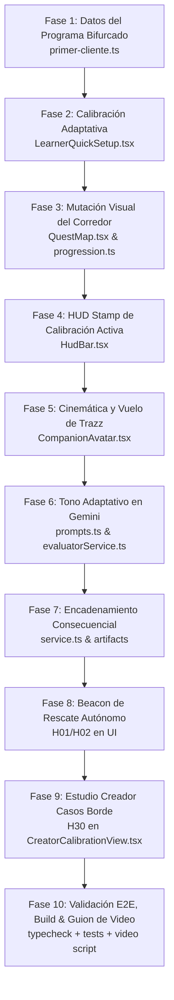

# PLAN_LAST_TIME — Roadmap de Implementación en 10 Fases (TRAZO Agentic End-to-End)

**Fecha de Creación:** 30 de Agosto, 2026  
**Objetivo:** Adaptar el producto TRAZO para maximizar el impacto en el Hackathon *All Things Agentic* de Google Cloud (<20 horas para la entrega).  
**Criterio Innegociable:** Cero alucinaciones, contratos deterministas inmutables, tests y compilación en verde en cada fase.

---

## FASE 1: Definición del Programa Pedagógico Bifurcado en Datos
* **Objetivo:** Configurar el pack de metodología `"Primer cliente digital"` con una bifurcación real de dos ramas y un nodo de convergencia final.
* **Archivos Afectados:**
  * [`src/data/packs/primer-cliente.ts`](../src/data/packs/primer-cliente.ts)
  * [`src/data/course.ts`](../src/data/course.ts)
* **Acciones Concretas:**
  1. Definir `C01`: *"Define tu oferta"* (Produce artefacto `offer`).
  2. Definir Rama A: `C02A` (5 Prospectos Directos) $\rightarrow$ `C03A` (Mensaje Directo Enviado).
  3. Definir Rama B: `C02B` (Premisa de Contenido) $\rightarrow$ `C03B` (Publicación de Lanzamiento).
  4. Definir `C04`: *"Primer Contacto y Cierre"* (Convergencia con `requiresAny: ['C03A', 'C03B']`).
  5. Cada nodo incluye rúbrica con 3 criterios estrictos (`isRequired: true`).
* **Criterio de Aceptación:** `tsc -b` compila limpio; el grafo no contiene ciclos y la validación de metodología pasa al 100%.

---

## FASE 2: Integración de la Entrevista de Calibración (Onboarding)
* **Objetivo:** Conectar las respuestas del usuario en el onboarding con las ramas reales del grafo y persistir su perfil de aprendizaje.
* **Archivos Afectados:**
  * [`src/components/LearnerQuickSetup.tsx`](../src/components/LearnerQuickSetup.tsx)
* **Acciones Concretas:**
  1. Actualizar `resolveBranchOptions` para mapear explícitamente:
     * **Opción A:** Vía Directa B2B (`C02A`).
     * **Opción B:** Vía Contenido e Inbound (`C02B`).
  2. Asegurar que al pulsar *"Materializar mi mapa"*, el payload `PATCH /api/v1/implementations/:id/learner-setup` guarde:
     * `preferredRouteId`: `'C02A'` o `'C02B'`.
     * `helpPreference`: `'DIRECT'`, `'QUESTIONS'` o `'EXAMPLE'`.
     * `availableTime`: `'15_30_MIN'`, `'30_60_MIN'` o `'1_2_HOURS'`.
* **Criterio de Aceptación:** Al finalizar el setup, el estado del backend contiene el `learnerSetup` completo y tipado.

---

## FASE 3: Mutación Visual del Corredor en el Quest Map (2.5D)
* **Objetivo:** Hacer que la ruta elegida se ilumine con el color de acción (`#3657FF`) y la ruta descartada se atenúe sutilmente.
* **Archivos Afectados:**
  * [`src/domain/progression.ts`](../src/domain/progression.ts)
  * [`src/components/QuestMap.tsx`](../src/components/QuestMap.tsx)
  * [`src/styles/trazo-tokens.css`](../src/styles/trazo-tokens.css)
* **Acciones Concretas:**
  1. Verificar que `deriveCorridor(chapter, preferredRouteId)` clasifique correctamente los IDs de nodos y aristas en `corridorMissionIds` y `dimmedMissionIds`.
  2. En `QuestMap.tsx`, asignar la clase `.quest-node--corridor` a los nodos activos y `.quest-node--dimmed` (opacidad 35%, sombra reducida) a los de la ruta alternativa.
* **Criterio de Aceptación:** El cambio de enfoque visual es inmediato y evidente en el canvas al completar la calibración.

---

## FASE 4: HUD Stamp de Calibración Activa
* **Objetivo:** Mostrar en la interfaz superior un distintivo permanente que recuerde el perfil adaptativo calibrado por el alumno.
* **Archivos Afectados:**
  * [`src/components/HudBar.tsx`](../src/components/HudBar.tsx)
  * [`src/components/ProductRouteFrame.tsx`](../src/components/ProductRouteFrame.tsx)
* **Acciones Concretas:**
  1. Extraer `implementationState.learnerSetup`.
  2. Renderizar un badge tipo "sello editorial" en el HUD:  
     `RUTA: [VÍA DIRECTA / VÍA CONTENIDO] · FEEDBACK: [AL GRANO / MAYÉUTICA] · TIEMPO: [30 MIN]`
* **Criterio de Aceptación:** El badge es visible permanentemente y se actualiza si el alumno recalibra su perfil.

---

## FASE 5: Cinemática y Vuelo Inicial de Trazz
* **Objetivo:** Que el avatar 2.5D viaje físicamente sobre la curva Bezier al iniciar la experiencia y se posicione en el primer nodo activo.
* **Archivos Afectados:**
  * [`src/components/CompanionAvatar.tsx`](../src/components/CompanionAvatar.tsx)
  * [`src/hooks/useCompanionTraveler.ts`](../src/hooks/useCompanionTraveler.ts)
* **Acciones Concretas:**
  1. Al materializarse el mapa, disparar la cinemática de viaje hacia el nodo `C01`.
  2. Ajustar los sprites de Trazz: postura de `vuelo-determinado` durante el trayecto e `idle` al aterrizar en la posición de descanso.
* **Criterio de Aceptación:** Animación fluida a 60fps sin tirones de DOM ni desalineaciones de coordenadas.

---

## FASE 6: Adaptación de Tono Pedagógico en Gemini 3.7 Flash
* **Objetivo:** Que las respuestas y el feedback de evaluación de Gemini reflejen con exactitud la preferencia de ayuda del alumno.
* **Archivos Afectados:**
  * [`src/server/evaluator/prompts.ts`](../src/server/evaluator/prompts.ts)
  * [`src/server/evaluator/evaluatorService.ts`](../src/server/evaluator/evaluatorService.ts)
* **Acciones Concretas:**
  1. Reforzar las directivas en `SYSTEM_PROMPT` para cada valor de `learnerHelpPreference`:
     * `DIRECT`: Explicación concisa, veredictos secos, puntos de acción directos.
     * `QUESTIONS`: Preguntas socráticas para inducir la auto-corrección sin dar la respuesta.
     * `EXAMPLE`: Inclusión de mini-ejemplos contrastados.
* **Criterio de Aceptación:** Un mismo texto de entrega produce feedback con diferente estructura según la calibración elegida.

---

## FASE 7: Encadenamiento Consecuencial de Artefactos Downstream
* **Objetivo:** Demostrar que los artefactos aprobados en `C01` alimentan las misiones siguientes y que contradecir la oferta previa causa un `REWORK`.
* **Archivos Afectados:**
  * [`src/server/service.ts`](../src/server/service.ts)
  * [`tests/consequentialMultiStep.test.ts`](../tests/consequentialMultiStep.test.ts)
* **Acciones Concretas:**
  1. En `C01`, al emitir `PASS`, crear el `ImplementationArtifact` tipo `offer`.
  2. En `C02A` / `C02B`, inyectar `offer` dentro de `<trusted_context>` y evaluar el criterio `c1_offer_alignment`.
  3. Si el alumno entrega prospectos que contradicen su oferta de `C01`, Gemini marca `NOT_MET` y la política emite `REWORK`.
* **Criterio de Aceptación:** Pruebas automatizadas de consistencia aprobadas al 100%.

---

## FASE 8: Beacon de Rescate Autónomo en Segundo Plano (H01 / H02)
* **Objetivo:** Visibilizar en la UI las intervenciones no solicitadas generadas por el `StallDetector` y el `AutonomyService`.
* **Archivos Afectados:**
  * [`src/components/CompanionAvatar.tsx`](../src/components/CompanionAvatar.tsx)
  * [`src/components/QuestMap.tsx`](../src/components/QuestMap.tsx)
  * [`src/styles/companion.css`](../src/styles/companion.css)
* **Acciones Concretas:**
  1. Consultar el estado de `autonomy_audits` en la implementación activa.
  2. Si existe un registro con `status: 'EXECUTED'` y decisión `INTERVENE`, activar en el avatar el halo pulsante azul cobalto.
  3. Mostrar un popover flotante con el mensaje de rescate y un botón de acción rápida *"Ir a misión sugerida"*.
* **Criterio de Aceptación:** La intervención aparece sola sin que el alumno haya hecho clic en ningún botón de ayuda.

---

## FASE 9: Botón de Simulación de Casos Borde para Creadores (H30)
* **Objetivo:** Conectar el estudio de calibración del creador para que Gemini genere 3 casos sintéticos de alumnos con 1 clic.
* **Archivos Afectados:**
  * [`src/components/CreatorCalibrationView.tsx`](../src/components/CreatorCalibrationView.tsx)
* **Acciones Concretas:**
  1. Añadir el botón *"Simular Casos Borde con Gemini"* que hace `POST /api/v1/calibrations/:id/generate-examples`.
  2. Renderizar las tarjetas con los casos simulados (un caso claro de PASS, un caso de REWORK y un caso límite).
  3. Permitir al coach confirmar la rúbrica activa con 1 clic.
* **Criterio de Aceptación:** La llamada a Gemini genera los ejemplos en tiempo real y el coach puede activar la versión con hash SHA-256.

---

## FASE 10: Validación Integral, Build & Guion del Video Demo
* **Objetivo:** Garantizar cero errores de tipos, pruebas verdes, contenedor Docker listo y guion de video optimizado para los 4 minutos.
* **Archivos Afectados:**
  * `README.md`
  * [`Dockerfile`](../Dockerfile)
* **Acciones Concretas:**
  1. Ejecutar `npm run typecheck` (`tsc -b`) $\rightarrow$ 0 errores.
  2. Ejecutar `npm test` $\rightarrow$ 100% PASS.
  3. Entregar el guion exacto segundo a segundo (0:00 a 4:00) para la grabación de la demo en video.
* **Criterio de Aceptación:** Repositorio en estado inmaculado, listo para despliegue en Google Cloud Run y grabación del video.
