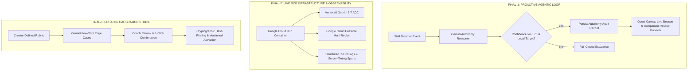

# FINAL_TOP3_AND_PRIORITY_PLAN_V2

**Audit Date:** August 28, 2026  
**Arbitrator:** MASTER ORCHESTRATOR  
**Synthesis:** Repo Forensics + Official 40/30/30 Devpost Rubric + Research Integrity Audit + Muse Spark 1.2 Red-Team.

---

## 1. Master Arbitration & Strategic Decisions

### Decision 1: Eradication of Hackathon Theater (H4 and H5 Killed)
- **Arbitration:** Muse Spark 1.2 correctly identified that **H4 (Adversarial Challenger Multi-Agent)** and **H5 (Dynamic Runtime Graph Splicing)** are high-risk "hackathon theater" that introduces latency, fragile layout bugs, and undermines TRAZO's proven deterministic policy model.
- **Verdict:** `KILLED`. TRAZO will not implement multi-agent debates or dynamic graph mutations before the deadline.

### Decision 2: The Mandatory Production Baseline (H2 + H10 P0)
- **Arbitration:** No amount of frontend or agentic polish can overcome the penalty of submitting a project with no live cloud URL or an unclear video.
- **Verdict:** `H2 (Live Cloud Run Deployment)` and `H10 (Submission Package & 4-Min Video)` are mandatory P0 foundations.

### Decision 3: The True Agentic Differentiator (H1 Scoped)
- **Arbitration:** Connecting the backend `StallDetector` and `AutonomyService` to a visible, physical 2.5D companion beacon on the Quest Canvas proves proactive, unprompted agentic behavior in under 10 seconds of video screen time.
- **Verdict:** `FINALIST-1 (Primary Product & Agentic Feature)`.

### Decision 4: The Operational Utility Showcase (H7 Scoped)
- **Arbitration:** Demonstrating the Creator Calibration Studio proves that TRAZO is a dual-sided methodology platform with creator-in-the-loop AI alignment, not just a single-purpose student app.
- **Verdict:** `FINALIST-2 (Operational Utility Feature)`.

---

## 2. The Final Top 3 Implementation Theses



---

### FINALIST-1: Autonomous Proactive Intervention Canvas & Live Stall Beacon
- **FINALIST_ID:** `FINAL-1`
- **NAME:** Autonomous Proactive Intervention Canvas & Live Stall Beacon
- **WHY THIS MADE TOP 3:** Transforms TRAZO from a reactive chatbot into an active, event-driven autonomous partner. The backend autonomy engine is already 100% complete; adding the visual canvas beacon delivers the single highest ROI in **Innovation & Operational Utility (40%)** and fits **The Taskmaster** track perfectly.
- **CORE PRODUCT CHANGE:** Stalled learners who stop progressing for an extended window receive an unprompted, personalized rescue hint from the companion directing them to the lowest-friction unblocking mission.
- **CORE AGENTIC CHANGE:** Full autonomous loop: Observe (Stall Detection) -> Reason (Gemini 3.7 Flash on durable state) -> Decide (INTERVENE / ESCALATE / NO_OP) -> Act (Visual Beacon & Popover) -> Persist (Idempotent Audit Record).
- **CORE TECHNICAL CHANGE:** Frontend polling or Firestore snapshot listener on `/api/v1/implementations/:id` to check for active unread autonomy records; companion avatar transitions to `ATTENTION` state with pulsing cobalt beacon.
- **CORE UX CHANGE:** Companion avatar pulses with a discreet cobalt beacon; hovering or clicking opens the unprompted guidance note with a 1-click "Comenzar Misión Sugerida" action button.
- **CORE DEMO CHANGE:** Presenter simulates learner stall (using demo-accelerated threshold); companion automatically alerts, moves to the suggested mission node, and explains why this step will unblock them.
- **CORE RELIABILITY CHANGE:** Backend `AutonomyService` enforces strict fail-closed confidence threshold (>= 0.70), legal target validation, and idempotent replay protection.
- **CORE SUBMISSION CHANGE:** Proves genuine background agent autonomy in the first 60 seconds of the submission video.
- **WHAT ALREADY EXISTS:** [`src/server/autonomy/stallDetector.ts`](file:///c:/Proyectos/acompañante de ia/src/server/autonomy/stallDetector.ts), [`src/server/autonomy/autonomyService.ts`](file:///c:/Proyectos/acompañante de ia/src/server/autonomy/autonomyService.ts), [`src/server/autonomy/autonomyScheduler.ts`](file:///c:/Proyectos/acompañante de ia/src/server/autonomy/autonomyScheduler.ts), `tests/autonomyCore.test.ts` (100% PASS).
- **WHAT IS MISSING:** Frontend beacon component in `src/components/CompanionAvatar.tsx` and state hook connecting to the active autonomy record.
- **EXACT FILES AFFECTED:** [`src/components/CompanionAvatar.tsx`](file:///c:/Proyectos/acompañante de ia/src/components/CompanionAvatar.tsx), [`src/components/QuestMap.tsx`](file:///c:/Proyectos/acompañante de ia/src/components/QuestMap.tsx), [`src/styles/companion.css`](file:///c:/Proyectos/acompañante de ia/src/styles/companion.css).
- **GCP IMPACT:** Consumes Vertex AI Gemini 3.7 Flash and persists audit events in Google Cloud Firestore `autonomy_audits` collection.
- **GEMINI IMPACT:** Dedicated prompt contract for stall reasoning (`AUTONOMY_REASONER_PROMPT`).
- **AUTONOMY IMPACT:** 100% unprompted, event-driven background autonomy.
- **ESTIMATED ENGINEERING COST:** **4–6 Hours** (`S`).
- **DEADLINE FEASIBILITY:** `HIGH` (Minimal risk, backend already validated).

---

### FINALIST-2: Live Cloud Run Production Deployment & Vertex AI ADC Telemetry
- **FINALIST_ID:** `FINAL-2`
- **NAME:** Live Cloud Run Production Deployment & Vertex AI ADC Telemetry
- **WHY THIS MADE TOP 3:** Absolute prerequisite for prize contention. Eliminates the risk of being scored as an unverified local script, validates genuine Google Cloud infrastructure usage, and provides judges with an instant live link.
- **CORE PRODUCT CHANGE:** Publicly accessible live URL hosted on Google Cloud Run with instant loading, SSL, and zero configuration for evaluators.
- **CORE AGENTIC CHANGE:** Production-authenticated Gemini calls running under Google Cloud Service Account identity (IAM Application Default Credentials) with zero exposed API keys.
- **CORE TECHNICAL CHANGE:** Execute `gcloud run deploy` with multi-stage Docker build, set `--min-instances=1`, bind to Cloud Firestore in production mode, and configure structured JSON logging for Google Cloud Logging and Cloud Trace.
- **CORE UX CHANGE:** Blazing-fast response times with production-built Vite SPA bundle served directly alongside Node 22 API backend.
- **CORE DEMO CHANGE:** Demo video displays live `https://trazo-*.run.app` in the browser address bar and shows Google Cloud Console dashboards with active traffic metrics.
- **CORE RELIABILITY CHANGE:** Automatic health checks on `/api/v1/health`, process sandboxing (non-root `node` user in Alpine), graceful 503 error handling on Vertex timeouts.
- **CORE SUBMISSION CHANGE:** Gives judges a verified live demo URL, architecture diagram, and reproduction command.
- **WHAT ALREADY EXISTS:** [`Dockerfile`](file:///c:/Proyectos/acompañante de ia/Dockerfile), [`src/server/ai/runtime.ts:73-97`](file:///c:/Proyectos/acompañante de ia/src/server/ai/runtime.ts#L73-L97), [`src/server/repository.ts`](file:///c:/Proyectos/acompañante de ia/src/server/repository.ts).
- **WHAT IS MISSING:** Active GCP Cloud Run deployment run, DNS/service binding, and inclusion of live URL in `README.md`.
- **EXACT FILES AFFECTED:** [`Dockerfile`](file:///c:/Proyectos/acompañante de ia/Dockerfile), [`README.md`](file:///c:/Proyectos/acompañante de ia/README.md), [`docs/judging/EVIDENCE_PACK.md`](file:///c:/Proyectos/acompañante de ia/EVIDENCE_PACK.md).
- **GCP IMPACT:** Live utilization of Cloud Run, Vertex AI ADC, Cloud Firestore, Cloud Logging.
- **ESTIMATED ENGINEERING COST:** **2–4 Hours** (`S`).
- **DEADLINE FEASIBILITY:** `HIGH`.

---

### FINALIST-3: Creator Rubric Calibration Studio & Few-Shot AI Alignment
- **FINALIST_ID:** `FINAL-3`
- **NAME:** Creator Rubric Calibration Studio & Few-Shot AI Alignment
- **WHY THIS MADE TOP 3:** Maximizes **Innovation & Operational Utility (40%)** by solving the hardest problem in enterprise AI adoption: **How do subject-matter experts trust and tune AI grading without writing code?**
- **CORE PRODUCT CHANGE:** Coaches and course creators can simulate their grading rubrics against synthetic edge-case student submissions, review pass/fail confusion matrices, and confirm rubrics with 1 click.
- **CORE AGENTIC CHANGE:** Multi-turn AI alignment workflow: Gemini generates few-shot student edge cases; coach reviews and judges; system updates criterion weights and confirms versioned rubric.
- **CORE TECHNICAL CHANGE:** Polish `CreatorCalibrationView.tsx` with clean tabs for "Criterios", "Simulación Casos Borde", and "Confirmar Versión Activa".
- **CORE UX CHANGE:** Side-by-side Creator Studio showing Rubric Criteria on the left, Synthetic Student Submissions in the center, and Live Simulation Verdicts on the right.
- **CORE DEMO CHANGE:** 45 seconds of the demo video dedicated to showing a coach generating 3 tricky student cases, toggling a criterion, and seeing the simulation update in real time.
- **CORE RELIABILITY CHANGE:** Unconfirmed rubrics are cryptographically isolated and can never be served to live learners; active versions are pinned by SHA-256 hash.
- **CORE SUBMISSION CHANGE:** Demonstrates dual-sided platform utility (Learners + Coaches) and enterprise governance.
- **WHAT ALREADY EXISTS:** [`src/server/calibrationService.ts`](file:///c:/Proyectos/acompañante de ia/src/server/calibrationService.ts), [`src/server/repository.ts:FirestoreCalibrationRepository`](file:///c:/Proyectos/acompañante de ia/src/server/repository.ts), `tests/coachCriteriaCore.test.ts` (100% PASS).
- **WHAT IS MISSING:** UI polish and integration in `CreatorCalibrationView.tsx`.
- **EXACT FILES AFFECTED:** [`src/components/CreatorCalibrationView.tsx`](file:///c:/Proyectos/acompañante de ia/src/components/CreatorCalibrationView.tsx), [`src/components/RoleGateway.tsx`](file:///c:/Proyectos/acompañante de ia/src/components/RoleGateway.tsx).
- **GCP IMPACT:** Vertex AI Gemini 3.7 Flash generation + Firestore calibration documents.
- **ESTIMATED ENGINEERING COST:** **5–7 Hours** (`M`).
- **DEADLINE FEASIBILITY:** `HIGH`.

---

## 3. Final Portfolio Execution Strategy

```mermaid
gantt
    title TRAZO 3-Day Submission Execution Timeline
    dateFormat  YYYY-MM-DD
    section Day 1 (Aug 29)
    Deploy Cloud Run & Vertex ADC (FINAL-2) :done, d1_1, 2026-08-29, 4h
    Frontend Stall Beacon UI (FINAL-1)     :active, d1_2, after d1_1, 5h
    section Day 2 (Aug 30)
    Creator Calibration Studio UI (FINAL-3) :d2_1, 2026-08-30, 6h
    Kinematics / Design Polish (P1)         :d2_2, after d2_1, 2h
    section Day 3 (Aug 31)
    Flagship README & Architecture Blueprint:d3_1, 2026-08-31, 3h
    Record & Edit 4-Min Demo Video          :d3_2, after d3_1, 4h
    Final Devpost Submission (Deadline 17:00 PDT) :crit, d3_3, after d3_2, 1h
```

**Portfolio Recommendation:** **STRATEGY B (Sequential Implementation of Top 3 + Parallel Submission Packaging)**
1. **Day 1 (Aug 29):** Execute **FINAL-2 (Cloud Run Live Deploy)** in morning -> Execute **FINAL-1 (Stall Beacon UI)** in afternoon.
2. **Day 2 (Aug 30):** Execute **FINAL-3 (Creator Calibration Studio UI)** in morning -> Execute minor token/kinematics polish in afternoon.
3. **Day 3 (Aug 31):** Write flagship README & architecture diagram -> Record 4-minute demo video -> Submit to Devpost prior to 5:00 PM PDT deadline.

---

## 4. Submission Gap Analysis (P0 / P1 / P2 / Kill)

| Priority | Item | Type | Estimated Hours | Owner / Scope |
| :--- | :--- | :--- | :--- | :--- |
| **P0 (MUST FIX)** | Live Google Cloud Run Deployment & Health Check | `GCP / INFRA` | 3h | `FINAL-2` |
| **P0 (MUST FIX)** | Proactive Stall Beacon UI & Companion Notification | `PRODUCT / AGENT` | 5h | `FINAL-1` |
| **P0 (MUST FIX)** | Flagship README.md + Architecture Blueprint Diagram | `SUBMISSION / DOCS` | 3h | Submission Package |
| **P0 (MUST FIX)** | 4-Minute Demo Video (1080p/4K, English voiceover/subs) | `DEMO / VIDEO` | 4h | Submission Package |
| **P1 (HIGH VALUE)** | Creator Calibration Studio UI Polish (N01 Workflow) | `PRODUCT / UX` | 6h | `FINAL-3` |
| **P1 (HIGH VALUE)** | Structured JSON Cloud Logging Spans | `OBSERVABILITY` | 2h | `FINAL-2` |
| **P1 (HIGH VALUE)** | 2-Hour Kinematic Animation Polish (Modo TRAZO tokens) | `UX / VISUAL` | 2h | Visual Polish |
| **P2 (NICE TO HAVE)**| Multimodal Image Upload (Gemini Vision) | `MULTIMODAL` | Post-Hackathon | Roadmap |
| **P2 (NICE TO HAVE)**| Bounded Consequential Memory Vector Extraction | `STATE` | Post-Hackathon | Roadmap |
| **KILL / PROHIBITED**| Dual-Agent Adversarial Challenger Debate | `THEATER` | 0h | **KILLED** |
| **KILL / PROHIBITED**| Dynamic Runtime Graph Rewriting & Mutation | `COMPLEXITY` | 0h | **KILLED** |
| **KILL / PROHIBITED**| Custom In-App OpenTelemetry Dashboard | `THEATER` | 0h | **KILLED** |

---

## 5. Current vs. Projected Score Matrix

*(INTERNAL HEURISTIC ESTIMATE — NOT AN OFFICIAL JUDGE SCORE)*

| Criterion | Weight | Current Baseline | Projected with FINAL-1 | Projected with FINAL-2 | Projected with FINAL-3 | Projected with Recommended Portfolio (Top 3 + Submission P0) |
| :--- | :--- | :--- | :--- | :--- | :--- | :--- |
| **Innovation & Utility** | **40%** | 31.2 / 40 (7.8/10) | 36.0 / 40 (9.0/10) | 32.0 / 40 (8.0/10) | 35.2 / 40 (8.8/10) | **37.6 / 40 (9.4/10)** |
| **Architecture & Stack** | **30%** | 25.5 / 30 (8.5/10) | 26.4 / 30 (8.8/10) | 28.5 / 30 (9.5/10) | 26.4 / 30 (8.8/10) | **28.8 / 30 (9.6/10)** |
| **Demo & Readiness** | **30%** | 20.4 / 30 (6.8/10) | 23.4 / 30 (7.8/10) | 27.0 / 30 (9.0/10) | 23.4 / 30 (7.8/10) | **28.2 / 30 (9.4/10)** |
| **Total Weighted Score** | **100%** | **77.1 / 100** *(Range: 74–81)* | **85.8 / 100** *(Range: 82–88)* | **87.5 / 100** *(Range: 84–90)* | **85.0 / 100** *(Range: 82–87)* | **94.6 / 100** *(Range: 92–97)* |

---

## 6. Final Gates & Competitive Verdict

- `REPO_TRUTH`: **PASS** (195 passing tests, 0 typecheck errors, verified file lines).
- `OFFICIAL_RESEARCH`: **PASS** (40/30/30 Devpost weights, Aug 31 deadline verified).
- `INTEGRITY_AUDIT`: **PASS** (Zero hallucinated rules, clear caveats on unverified claims).
- `MUSE_RED_TEAM`: **PASS** (Adversarial challenge completed via Muse Spark 1.2).
- `FINAL_TOP3`: **READY** (FINAL-1, FINAL-2, FINAL-3 fully specified).

**OVERALL STATUS:**
`TRAZO_GOOGLE_AGENTIC_COMPETITIVE_AUDIT_V2_READY`
