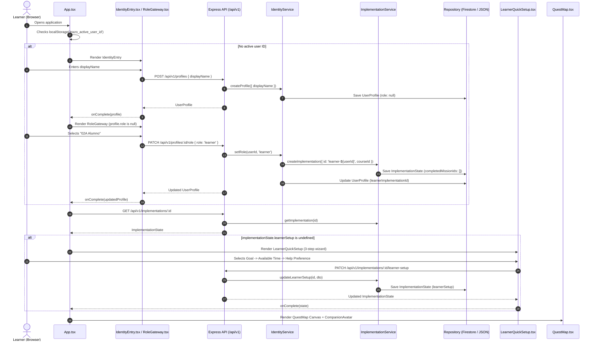

# TRAZO Google — First-Run & Route Materialization Feasibility Audit

> **Status:** FEASIBILITY AUDIT COMPLETE  
> **Evaluation Mode:** Read & Trace Only (No Code Modifications)  
> **Scope:** Learner First-Run Experience vs. Creator Calibration Studio Polish for Google "All Things Agentic" Hackathon  
> **Repository:** `C:\Proyectos\acompañante de ia`  

---

## Executive Summary & Final Verdict

### Final Verdict: `FIRST_RUN_GO_WITH_REDUCED_SCOPE`

Replacing the planned Creator Calibration Studio polish with a **focused Learner First-Run & Route Materialization experience** is **architecturally sound, low-risk, and significantly superior for hackathon evaluation and demo impact**.

The existing codebase already contains:
1. Canonical branching and convergence mechanisms (`requiresAny`, `MissionEdge`, `MethodologyGraphRuntime`).
2. Live Vertex AI Gemini runtime integration with JSON schemas and retry loops (`GeminiNextActionProposer`).
3. React Flow node and edge custom renderers with animation states (`QuestNode`, `QuestEdge`).
4. Kinematic companion motion along SVG splines (`useCompanionTraveler`, `CompanionAvatar`).

By reducing the first-run scope to **exactly 1 high-information question** mapping directly to existing methodology branches (e.g. *Estructura Directa* vs *Estructura Narrativa*), we achieve a visually arresting, highly agentic demo in **~4.5 hours of engineering**, with zero changes to canonical methodology schemas or deterministic progression invariants.

---

## 1. Current First-Run Flow (Exact Code Trace)

The current first-run journey from initial arrival to map rendering follows this strict sequential flow:



### Exact Layer Execution Path
1. **User Action:** Enters display name in [`IdentityEntry.tsx`](file:///c:/Proyectos/acompañante%20de%20ia/src/components/IdentityEntry.tsx#L15-L33).
2. **API:** `POST /api/v1/profiles` in [`app.ts`](file:///c:/Proyectos/acompañante%20de%20ia/src/server/app.ts#L429-L441).
3. **Domain Service:** `IdentityService.createProfile()` in [`identityService.ts`](file:///c:/Proyectos/acompañante%20de%20ia/src/server/identityService.ts#L65-L80).
4. **State Mutation & Persistence:** Stores `UserProfile` in Firestore collection `user_profiles` via [`FirestoreProfileRepository`](file:///c:/Proyectos/acompañante%20de%20ia/src/server/repository.ts#L216-L240).
5. **User Action:** Clicks "Alumno" in [`RoleGateway.tsx`](file:///c:/Proyectos/acompañante%20de%20ia/src/components/RoleGateway.tsx#L14-L30).
6. **API:** `PATCH /api/v1/profiles/:id/role` in [`app.ts`](file:///c:/Proyectos/acompañante%20de%20ia/src/server/app.ts#L459-L468).
7. **Domain Service:** `IdentityService.setRole()` calls `ImplementationService.createImplementation()` in [`service.ts`](file:///c:/Proyectos/acompañante%20de%20ia/src/server/service.ts#L155-L194).
8. **State Mutation & Persistence:** Stores `ImplementationState` in Firestore collection `implementations`.
9. **Component Gate:** [`App.tsx`](file:///c:/Proyectos/acompañante%20de%20ia/src/App.tsx#L579-L581) checks `if (!implementationState?.learnerSetup)` and renders [`LearnerQuickSetup.tsx`](file:///c:/Proyectos/acompañante%20de%20ia/src/components/LearnerQuickSetup.tsx).
10. **User Action:** Completes 3-step wizard in `LearnerQuickSetup.tsx`.
11. **API:** `PATCH /api/v1/implementations/:id/learner-setup` handled by [`service.updateLearnerSetup()`](file:///c:/Proyectos/acompañante%20de%20ia/src/server/service.ts#L196-L218).
12. **QuestMap Render:** `App.tsx` renders [`QuestMap.tsx`](file:///c:/Proyectos/acompañante%20de%20ia/src/components/QuestMap.tsx) with [`CompanionAvatar.tsx`](file:///c:/Proyectos/acompañante%20de%20ia/src/components/CompanionAvatar.tsx). Initial node is `available`, companion sits at entry node.

---

## 2. Current Learner State Audit

Every field collected from the learner in the current repository was traced across types, persistence, prompts, and progression:

| Field | Type | Required? | When Collected? | Where Stored? | Consumers in Codebase | Does Gemini See It? | Progression Impact | Companion Impact | Route Impact |
| :--- | :--- | :--- | :--- | :--- | :--- | :--- | :--- | :--- | :--- |
| `displayName` | `string` (≤80 chars) | **Yes** | Step 1 (`IdentityEntry`) | `UserProfile.displayName` (`user_profiles`) | UI headers, `RoleGateway`, `HudBar`, `CompanionService` | **Yes** (`NextActionContext.profile`) | None | Tone & addressing | None |
| `goal` | `string` (≤300 chars, 3 presets) | **Yes** | Step 1 of `LearnerQuickSetup` | `ImplementationState.learnerSetup.goal` (`implementations`) | None (dormant in DB) | **No** (omitted in prompt) | None | None | None |
| `availableTime` | `'15_30_MIN' \| '30_60_MIN' \| '1_2_HOURS' \| 'VARIES'` | **Yes** | Step 2 of `LearnerQuickSetup` | `ImplementationState.learnerSetup.availableTime` (`implementations`) | None (dormant in DB) | **No** | None | None | None |
| `helpPreference` | `'DIRECT' \| 'QUESTIONS' \| 'EXAMPLE' \| 'ADAPTIVE'` | **Yes** | Step 3 of `LearnerQuickSetup` | `ImplementationState.learnerSetup.helpPreference` (`implementations`) | `adaptCompanionGuidance()` in [`learner.ts`](file:///c:/Proyectos/acompañante%20de%20ia/src/domain/learner.ts#L8-L26) | **No** (applied in deterministic TS post-eval) | None | Appends question/example string on `REWORK`/`CLARIFY` | None |

> [!WARNING]
> **Audit Finding:** The current 3-step `LearnerQuickSetup` wizard collects 3 fields, of which **2 are 100% dormant** and **0 affect the journey, routing, or initial framing**. Replacing this wizard removes dead weight and replaces it with high-leverage route context.

---

## 3. Current Graph & Branch Capabilities

Detailed evaluation of the existing graph and methodology architecture:

1. **Can the canonical methodology graph already contain branches?**  
   **YES.** [`MethodologyGraph`](file:///c:/Proyectos/acompañante%20de%20ia/src/domain/methodology.ts#L68-L84) and [`Chapter`](file:///c:/Proyectos/acompañante%20de%20ia/src/domain/course.ts#L314-L323) support multiple outgoing edges from any node (`edge.type: 'DEFAULT' | 'CONDITIONAL' | 'REMEDIATION' | 'OPTIONAL'`), multiple prerequisites, `requiresAny: string[]`, and visual junctions (`MapJunction`).
2. **Can multiple valid routes lead toward the same downstream outcome?**  
   **YES.** Supported via the `requiresAny` invariant. In [`src/data/course.ts`](file:///c:/Proyectos/acompañante%20de%20ia/src/data/course.ts#L183-L197), node `N05` (*Ensamble*) specifies `requiresAny: ['N02', 'N03']`. Completing either the direct route (`N02`) or the narrative route (`N03`) satisfies `N05`.
3. **Can the learner currently choose between available branches?**  
   **YES.** In runtime, when prerequisites are satisfied, multiple nodes have `progressState === 'available'`. The learner can click any available node to start it, or use [`CompanionNextAction.tsx`](file:///c:/Proyectos/acompañante%20de%20ia/src/components/CompanionNextAction.tsx) to get a Gemini recommendation.
4. **Can code deterministically restrict selection to legal branches?**  
   **YES.** [`CompanionService.proposeNextAction()`](file:///c:/Proyectos/acompañante%20de%20ia/src/server/companion/companionService.ts#L94-L101) verifies that `availableMissions.some(m => m.id === proposal.missionId)` and throws an error on hallucinated or locked nodes. [`ImplementationService.startMission()`](file:///c:/Proyectos/acompañante%20de%20ia/src/server/service.ts#L259-L272) rejects locked missions with status 400.
5. **Can a branch/corridor be visually emphasized without changing canonical graph state?**  
   **YES.** [`QuestNode.tsx`](file:///c:/Proyectos/acompañante%20de%20ia/src/components/QuestNode.tsx#L58-L64) already supports `data-recommended={recommended}` and `data-selected={selected}`. [`QuestEdge.tsx`](file:///c:/Proyectos/acompañante%20de%20ia/src/components/QuestEdge.tsx#L70-L77) supports `data-route={'traveled' | 'immediate' | 'future'}` and `data-highlighted`.
6. **Does selecting a route require schema changes?**  
   **NO.** Corridor preference is presentation/learner state. `ImplementationState` already holds `activeMissionId`.
7. **Does it require progression changes?**  
   **NO.** Progression invariants in [`progression.ts`](file:///c:/Proyectos/acompañante%20de%20ia/src/domain/progression.ts) and [`methodologyRuntime.ts`](file:///c:/Proyectos/acompañante%20de%20ia/src/domain/methodologyRuntime.ts) remain completely untouched.
8. **Does it require methodology hash changes?**  
   **NO.** [`computeMethodologyCanonicalHash`](file:///c:/Proyectos/acompañante%20de%20ia/src/domain/methodology.ts#L94-L170) is computed from the immutable graph structure. Learner presentation state is decoupled.
9. **Could route preference exist as learner/implementation state without mutating the methodology?**  
   **YES.** It can be stored as an optional field in `LearnerSetup` or transient client state.
10. **Are there existing fixtures where this can be demonstrated?**  
    **YES.** [`src/data/course.ts`](file:///c:/Proyectos/acompañante%20de%20ia/src/data/course.ts) (`primer-sistema-de-contenido`) features:
    - Entry: `N01` (*Premisa*)
    - Branch A: `N02` (*Estructura Directa*)
    - Branch B: `N03` (*Estructura Narrativa*)
    - Optional Node: `N04` (*Revisión Opcional*)
    - Convergence: `N05` (*Ensamble*)
    - Milestone: `N09` (*Primera Pieza en Mercado*)

---

## 4. Gemini Recommendation Feasibility

The repository already includes [`CanonicalGeminiRuntime`](file:///c:/Proyectos/acompañante%20de%20ia/src/server/ai/runtime.ts) and [`GeminiNextActionProposer`](file:///c:/Proyectos/acompañante%20de%20ia/src/server/companion/geminiProposer.ts).

### Minimal Safe Contract for First-Run Route Recommendation

```typescript
// Strict input context passed to Gemini
export interface FirstRunRecommendationContext {
  courseTitle: string
  chapterPromise: string
  learnerContext: {
    displayName: string
    preferredStyle: 'direct' | 'narrative' | 'speed' | 'flexible'
  }
  validBranches: Array<{
    missionId: string
    title: string
    description: string
    corridorMissionIds: string[]
  }>
}

// Strict structured output returned by Gemini
export interface FirstRunRecommendationResponse {
  recommendedMissionId: string
  corridorMissionIds: string[]
  rationale: string
  confidence: number
}
```

### Deterministic Guardrails
1. **Verification of ID Existence:** The backend strictly checks `validBranches.some(b => b.missionId === response.recommendedMissionId)`.
2. **Corridor Validity:** All IDs in `corridorMissionIds` must exist in the active chapter.
3. **Deterministic Fallback:** If Gemini fails or times out, the backend/UI defaults to the primary branch (`N02`) with a clear deterministic rationale.
4. **Zero Progression Side Effects:** The proposal does not mark any node as completed or unlocked. Node `N01` remains the entry node.

---

## 5. First-Run UX Feasibility

### Target Flow (Replaces Monotonous Wizard)
1. **Identity & Role (Unchanged):** Learner enters name (`IdentityEntry`) -> Chooses "Alumno" (`RoleGateway`).
2. **First-Run Route Framing (`LearnerRouteFraming.tsx`):**
   - Welcomes the learner: *"Hola Pablo. Este programa te llevará de una idea a tu primera señal real en mercado."*
   - Displays the single high-leverage question:
     > **"¿Cómo prefieres estructurar tu primera pieza?"**
     > - **Directa y concisa (Ruta Ágil):** Apertura, desarrollo y llamado a la acción directo. Menor fricción.
     > - **Narrativa con historia (Ruta de Conexión):** Situación inicial, tensión y resolución. Mayor profundidad.
3. **Instant Companion Recommendation:**
   - Companion evaluates the selection and highlights the recommended corridor:
     > *"Para validar rápido con mínima fricción, te sugiero la **Ruta Directa**. Comenzaremos con tu premisa y avanzaremos directo al ensamble."*
4. **Confirmation & Materialization:**
   - Learner clicks **"Comenzar mi recorrido →"**.
   - UI transitions directly to `QuestMap`.
5. **QuestMap Corridor Materialization:**
   - The selected corridor (`N01` -> `N02` -> `N05` -> `N09`) is visually highlighted (connected glowing edges, distinct badge).
   - Unchosen alternative branch (`N03` -> `N04`) is faintly rendered (`opacity: 0.35`).
   - Companion avatar executes an entrance animation to `N01` (*Premisa*).
   - `selectedMissionId` opens `N01` in the mission panel ready for evidence submission.

---

## 6. High-Information Question Candidates Audit

We audited potential learner questions against the rule: **"Do not invent questions; ask only what materially alters a valid route."**

| Candidate Question | State Captured | Route Decision Changed | Value & Rationale | Can It Be Inferred? | Keep or Remove? |
| :--- | :--- | :--- | :--- | :--- | :--- |
| **Q1: "¿Qué estilo o formato prefieres para tu primera entrega?"** | Format / style preference | Selects between `N02` (*Estructura Directa*) and `N03` (*Estructura Narrativa*) | **CRITICAL.** Directly maps to the coach-defined branching DAG in Chapter 1. | No (zero prior submissions at first-run). | **KEEP (Primary Question)** |
| **Q2: "¿Cuánto tiempo sueles tener para trabajar?"** | Available time | **None.** Rubrics and DAG requirements are strictly invariant. | **ZERO.** Does not alter the DAG or evaluation standard. | Yes (observable later by submission cadence). | **REMOVE** |
| **Q3: "¿Cómo prefieres que te ayude TRAZO al atorarte?"** | Help mode (questions vs examples) | **None.** Does not alter the route; only changes feedback wording. | **LOW at first-run.** Can default to adaptive and be configured later in settings. | Yes (can be adapted from first rework response). | **REMOVE from first-run** |
| **Q4: "¿Cuál es tu nivel de experiencia en este canal?"** | Experience level | Weak correlation to Direct (beginner) vs Narrative (advanced). | **MODERATE, but redundant with Q1.** | Can be inferred from Q1 choice. | **REMOVE** |

> **Conclusion:** **Exactly 1 high-information question** is required for Chapter 1.

---

## 7. QuestMap Materialization Feasibility

Visual materialization is **100% feasible within existing React Flow components** without refactoring the layout engine or companion kinematics:

```
[ N01 Premisa (Active) ]
         │
         ├─── (Glowing Corridor Edge) ───► [ N02 Estructura Directa (Corridor) ] ───► [ N05 Ensamble ] ───► [ N09 Milestone ]
         │
         └─── (Faint 30% Opacity Edge) ──► [ N03 Estructura Narrativa (Dimmed) ]
```

### Affected Visual Elements
1. **`QuestNode.tsx`:**
   - Receives `isCorridor: boolean` and `isDimmed: boolean`.
   - Adds `data-corridor="true"` (accent border / subtle halo).
   - Adds `data-dimmed="true"` (`opacity: 0.45` for non-corridor branches).
2. **`QuestEdge.tsx`:**
   - Edges along the corridor receive `data-corridor="true"` (`stroke: var(--trazo-indigo)`, `stroke-width: 3.5px`, animated dash flow).
   - Edges outside the corridor receive `data-dimmed="true"` (`opacity: 0.25`).
3. **`CompanionAvatar.tsx`:**
   - Already contains full kinematic travel logic (`useCompanionTraveler`) and resting state positioning.
   - Sits prominently at `N01` with entrance cue.

---

## 8. Files & Modules Affected

| Layer | File / Module | Nature of Change |
| :--- | :--- | :--- |
| **Presentation / UX** | `src/components/LearnerQuickSetup.tsx` -> `src/components/LearnerFirstRun.tsx` | Replace 3-step static form with sleek 1-question route framing & corridor preview. |
| **Presentation / UX** | `src/App.tsx` | Pass `preferredCorridor` / `recommendedMissionIds` to `QuestMap`. |
| **Map Rendering** | `src/components/QuestMap.tsx` | Pass corridor metadata to node and edge data arrays. |
| **Node Component** | `src/components/QuestNode.tsx` | Support `data-corridor` and `data-dimmed` attributes. |
| **Edge Component** | `src/components/QuestEdge.tsx` | Support `data-corridor` animated styling. |
| **Styles** | `src/styles.css` | Add ~25 lines of CSS for `.quest-edge-path[data-corridor="true"]` and dimmed nodes. |
| **Backend Service** | `src/server/service.ts` | Store `preferredRouteId` / `corridorMissionIds` in `LearnerSetup` DTO. |
| **Tests** | `tests/firstRunRouteMaterialization.test.ts` | New unit test suite verifying recommendation contract, guardrails, and corridor derivation. |

---

## 9. Engineering Cost Classification

| Component | Scope Size | Realistic Dev Time | Notes |
| :--- | :--- | :--- | :--- |
| **Backend & API** | SMALL | 45 min | Extend `LearnerSetupDTO` with optional `preferredRouteId`. |
| **Domain Types** | SMALL | 15 min | Add optional `preferredRouteId` to `LearnerSetup`. |
| **Gemini Integration** | SMALL | 45 min | Fast prompt template for route rationale with deterministic fallback. |
| **First-Run UI Component** | MEDIUM | 90 min | Sleek interactive route selection card with instant confirmation. |
| **QuestMap & Edge Styling** | SMALL | 45 min | CSS attributes for corridor glowing edges and dimmed branches. |
| **Companion Kinematics** | NONE | 0 min | Existing `CompanionAvatar` kinematics fully reused. |
| **Automated Tests** | SMALL | 30 min | Unit tests for deterministic validation and fallback. |
| **Total Estimate** | **M (~4.5 hours)** | **Safe before deadline (<8h)** |

---

## 10. Risks & Stop Conditions Evaluation

| Stop Condition / Risk | Repo Evidence / Evaluation | Triggered? |
| :--- | :--- | :--- |
| **Migration of canonical methodology schema** | Canonical schema untouched. Presentation-level corridor. | ❌ NO |
| **Dynamic graph rewriting** | DAG is completely static and coach-defined. | ❌ NO |
| **Progression invariant alterations** | Invariants in `progression.ts` remain 100% deterministic. | ❌ NO |
| **QuestMap layout engine replacement** | React Flow layout is preserved entirely. | ❌ NO |
| **Major React Flow refactor** | Only CSS class attributes added to nodes/edges. | ❌ NO |
| **Realistic work >8h** | Estimated at ~4.5h. | ❌ NO |
| **PASS / REWORK integrity threat** | Evaluator pipeline is completely untouched. | ❌ NO |
| **Cloud Run deployment risk** | No native binaries or complex dependencies added. | ❌ NO |
| **Broad test suite rewrites** | Existing 34 test suites remain green; only new tests added. | ❌ NO |

---

## 11. First-Run vs. Creator Calibration Studio Polish

| Evaluation Dimension | First-Run & Route Materialization | Creator Calibration Studio Polish | Winner |
| :--- | :--- | :--- | :--- |
| **Innovation & Operational Utility** | Transforms static onboarding into an agentic guided journey. | Incremental UI polish on existing working calibration. | **FIRST-RUN WINS** |
| **Collaborative Partner Fit** | Direct embodiment of AI partner guiding student through coach rules. | Creator-facing calibration (already functional). | **FIRST-RUN WINS** |
| **Agentic Clarity** | High: Bounded recommendation inside deterministic graph. | High: Rubric synthesizer. | **TIE** |
| **Learner Utility** | Immediate, tangible impact on the learner's very first action. | Zero learner utility (creator only). | **FIRST-RUN WINS** |
| **Creator Utility** | Honors creator's DAG branches and guides students effectively. | Allows creators to calibrate rubrics from examples. | **CALIBRATION WINS** |
| **Demo Power & "Wow Factor"** | Video starts with instant route materialization and glowing map. | Video shows form inputs and calibration tables. | **FIRST-RUN WINS** |
| **Visual Memorability** | Animated React Flow corridor and companion movement. | Standard text cards and buttons. | **FIRST-RUN WINS** |
| **Engineering Effort** | ~4.5 hours. | ~4.0 hours. | **TIE** |
| **Regression Risk** | Low (decoupled from evaluator). | Low. | **TIE** |
| **Google Cloud Relevance** | Vertex AI Gemini Flash + Firestore. | Vertex AI Gemini Flash + Firestore. | **TIE** |
| **Gemini Relevance** | Interactive navigational companion with structured JSON. | Offline rubric generator. | **TIE** |
| **Long-term TRAZO Value** | Essential for learner activation and completion rates. | Essential for creator onboarding. | **TIE** |
| **Finish Before Deadline** | Safe (≤4.5h). | Safe (≤4.0h). | **TIE** |

---

## 12. Recommendation

### Strategic Recommendation: Implement First-Run & Route Materialization (V1 Reduced Scope)

Creator Calibration Studio is already functional: it accepts initial standards, adds creator examples, generates synthetic examples, judges examples, proposes rubrics, and confirms them to Firestore. Additional polish on Calibration Studio yields diminishing returns for hackathon judges who spend 80% of their evaluation time reviewing the **learner experience and collaborative partner dynamics**.

Implementing the **Learner First-Run & Route Materialization** directly addresses the hackathon's "Collaborative Partner" theme, dramatically elevates the demo video opening, and grounds Gemini's role as an intelligent, bounded guide across coach-defined methodology branches.

---

## 13. First-Run V1 Minimum Scope Specification

### 1. User Flow
1. Learner enters name in `IdentityEntry` -> Selects "Alumno" in `RoleGateway`.
2. Learner sees `LearnerFirstRun` screen:
   - Header: *"TRAZO · Configura tu recorrido"*
   - Single Question: *"¿Cómo prefieres estructurar tu primera pieza?"*
     - Option A: **Estructura Directa** (*Apertura, desarrollo y llamado directo. Validación ágil.*)
     - Option B: **Estructura Narrativa** (*Historia, tensión y resolución. Conexión profunda.*)
   - TRAZO Companion Box: Instant rationale generated by Gemini (or instant fallback):
     > *"Para validar tu idea en mercado con menor fricción, te recomiendo la **Ruta Directa**. Comenzaremos con tu premisa y avanzaremos al ensamble."*
   - CTA: *"Confirmar y Ver Mi Ruta →"*
3. Screen transitions to `QuestMap`:
   - Corridor `N01` -> `N02` -> `N05` -> `N09` glows with animated indigo flow.
   - `N03` and `N04` are rendered in faint dashed style.
   - Companion avatar moves to `N01` (*Premisa*).
   - Mission panel for `N01` opens automatically.

### 2. State & API
- DTO in `LearnerSetupDTO`: `{ preferredRouteId: 'N02' | 'N03', helpPreference?: 'ADAPTIVE' }`.
- Persisted in `ImplementationState.learnerSetup`.
- Read by `QuestMap` to derive `corridorMissionIds`.

### 3. Explicitly Deferred (Out of Scope for V1)
- Dynamic graph generation (strictly forbidden).
- Multi-chapter corridor chaining (Chapter 1 is sufficient).
- Real-time conversational audio companion during first run.
- Complex multi-step quiz wizards.
