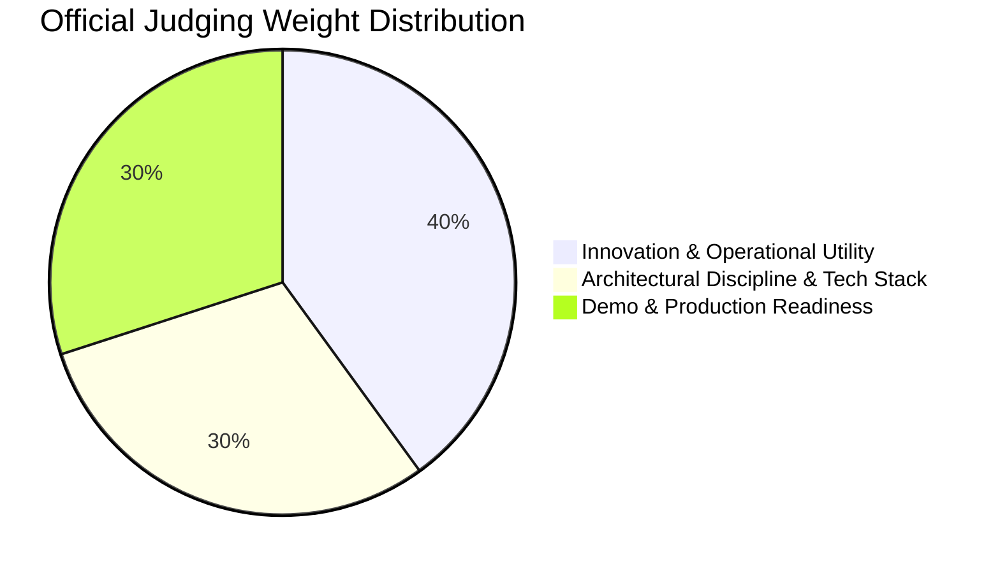

# OFFICIAL_HACKATHON_RESEARCH_V2

**Audit Date:** August 28, 2026  
**Auditor:** OFFICIAL_RESEARCH_AGENT  
**Competition:** Google All Things Agentic Hackathon  
**Official Portal:** [allthingsagentichackathon.devpost.com](https://allthingsagentichackathon.devpost.com)

---

## 1. External Source Register

| SOURCE_ID | Organization | Title | URL | Publication / Update Date | Date Accessed | Authority | Claims Supported |
| :--- | :--- | :--- | :--- | :--- | :--- | :--- | :--- |
| **SRC-01** | Devpost / Google Cloud | All Things Agentic Hackathon Overview & Rules | `https://allthingsagentichackathon.devpost.com/` | August 2026 | Aug 28, 2026 | `OFFICIAL` | Deadline (Aug 31, 2026, 5:00 PM PDT), $180k prize pool, 3 main tracks, submission requirements. |
| **SRC-02** | Google Cloud / Devpost | Judging Criteria & Weightings | `https://allthingsagentichackathon.devpost.com/` | August 2026 | Aug 28, 2026 | `OFFICIAL` | 40% Innovation & Operational Utility, 30% Architectural Discipline & Tech Stack, 30% Demo & Production Readiness. |
| **SRC-03** | Google Developers | All Things Agentic Hackathon Announcement | `https://google.dev` | August 2026 | Aug 28, 2026 | `FIRST_PARTY` | Focus on Gemini 3.5 / Gemini 3.7 models, Google Cloud deployment, Agent Development Kit (ADK), GenAI SDK, $150 GCP trial credits. |
| **SRC-04** | Google Cloud Devpost Video Guidelines | Submission Demo & Technical Spec | `https://allthingsagentichackathon.devpost.com/` | August 2026 | Aug 28, 2026 | `OFFICIAL` | Max 4-minute demo video, public/accessible code repository, comprehensive architecture diagram, reproducible README. |

---

## 2. Official Rules & Requirements Breakdown

### A. Deadlines & Window
- **Submission Deadline:** Monday, August 31, 2026 at 5:00 PM PDT.
- **Current Local Status:** August 28, 2026 (~3 calendar days remaining).

### B. Tracks & Categories
1. **Track 1: The Taskmaster (Event-Driven Autonomous Workflows)**
   - *Definition:* Autonomous agents that observe triggers, execute multi-step workflows across systems, and handle edge cases without continuous human intervention.
2. **Track 2: The Collaborative Partner (Stateful Human-Agent Collaboration)**
   - *Definition:* Context-aware agents that maintain persistent memory across turns, guide users through complex decision trees, and provide adaptive assistance.
3. **Track 3: The Fortified Enterprise Fleet (Governed Multi-Agent Systems)**
   - *Definition:* Multi-agent networks with explicit security, role-based governance, auditability, and zero-trust policies.
4. **Additional Categories & Bonus Awards:**
   - *Grand Prize:* $50,000.
   - *Best Architectural Design:* Rewarding clean boundaries, state durability, and decoupling.
   - *Best Multimodal UX:* Rewarding innovative visual/spatial interfaces that transcend simple chat.
   - *Startup Excellence:* For incorporated entities / high-growth venture potential.

### C. Official Judging Criteria & Weights

1. **Innovation & Operational Utility (40%):**
   - Does the agent solve a real, high-friction problem?
   - Is it genuinely autonomous and consequential, or merely a prompt wrapper around a chatbot?
   - Does it create durable, tangible value for the user?
2. **Architectural Discipline & Tech Stack (30%):**
   - Engineering robustness: Decoupling, state management, persistent memory, failure handling (fail-closed), security, and credential management.
   - Genuine use of Google Cloud stack (Vertex AI, Cloud Run, Firestore, GenAI SDK / ADK).
   - Zero "architecture theater"—every component must serve a concrete functional purpose.
3. **Demo & Production Readiness (30%):**
   - Video quality: Clear, concise, unedited 4-minute demonstration proving the agent operates in real time.
   - Reproducibility: Clean repository, working configuration, architecture diagrams, and clear setup instructions.
   - Production evidence: Visible proof that the system runs live on Google Cloud.

---

## 3. Official Judge Signal Analysis

| Category | High-Reward Signal (What Judges Look For) | Anti-Pattern / Score Penalty (What Judges Penalize) |
| :--- | :--- | :--- |
| **Agentic Depth** | Autonomous event triggers, stateful multi-step progression, fail-closed self-correction, deterministic guardrails. | Simple single-turn chatbot, "prompt-only" agent without real state or tools, fake autonomy claims. |
| **Google Cloud Leverage** | Native Vertex AI / GenAI SDK integration, Cloud Run containerization, Firestore document state, IAM / ADC auth. | Cosmetic Google API call dropped into an AWS/Vercel monolith with no architectural role. |
| **State & Memory** | Structured domain state, cryptographic provenance, immutable canonical artifacts, DAG dependency tracking. | Passing raw unvalidated chat transcript as "long-term memory". |
| **Reliability** | Strict fail-closed policy, low-confidence escalation, concurrency serialization, schema validation. | Letting LLM hallucinations mutate database state or approve invalid submissions. |
| **UX & Interaction** | Visual, spatial, and tactile UI (e.g., interactive canvas, real-time kinematics, contextual inspectability). | Generic dark-mode SaaS chat template with purple gradients and AI buzzwords. |

---

## 4. Track Fit for TRAZO
- **Primary Track Recommendation:** **The Collaborative Partner** (Stateful companion, persistent learner context, adaptive guidance) OR **The Taskmaster** (Event-driven autonomous stall detection, multi-step verified action loop).
- **Special Award Targets:** **Best Architectural Design** (Deterministic Policy + DAG Engine) & **Best Multimodal UX** (2.5D Canvas Kinematics + Spatial Quest Map).
