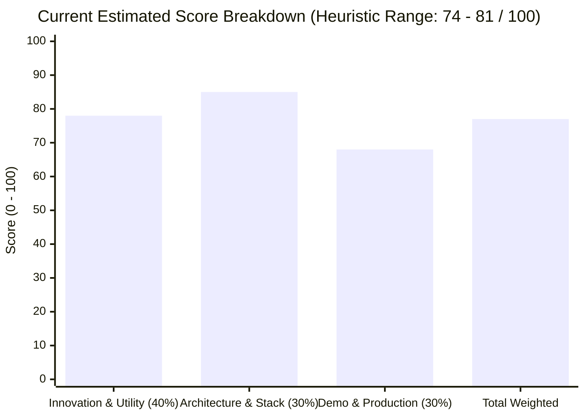

# TRAZO_CURRENT_SCORE_V2
*(INTERNAL_HEURISTIC_ESTIMATE — NOT AN OFFICIAL JUDGE SCORE)*

**Audit Date:** August 28, 2026  
**Auditor:** SCORE_AND_HYPOTHESES_AGENT  
**Basis:** Stage 1 Truth Map + Stage 2 Official Hackathon Rubric + Stage 3 Integrity Audit.

---

## 1. Official Rubric Evaluation (Current State)

### Criterion 1: Innovation & Operational Utility (Weight: 40%)
- **Raw Strength:** `7.8 / 10`
- **Weighted Contribution:** `31.2 / 40`
- **Confidence:** `HIGH`
- **Why:** Replaces low-retention linear courses and superficial chat prompts with an interactive 2.5D visual Quest Map DAG and real-world verified deliverables. Removes real friction for both independent learners (getting actionable, rubric-aligned feedback without human delays) and creators/coaches (defining executable methodology graphs without manual grading fatigue).
- **Repo Evidence:** [`src/components/QuestMap.tsx`](file:///c:/Proyectos/acompañante de ia/src/components/QuestMap.tsx), [`src/domain/evaluationPolicy.ts`](file:///c:/Proyectos/acompañante de ia/src/domain/evaluationPolicy.ts), [`src/data/packs/primer-cliente.ts`](file:///c:/Proyectos/acompañante de ia/src/data/packs/primer-cliente.ts).
- **Missing / Weakness:** The autonomous stall intervention is implemented backend-side and covered by tests, but currently lacks an explicit, high-visibility visual toast/callout in the frontend UI when an intervention event fires in background.
- **Likely Judge Question:** *"How does this differ from asking Gemini directly to grade an assignment?"*
- **Answer:** Gemini only interprets text against rubrics; deterministic TRAZO code enforces prerequisites, manages DAG topology, produces immutable downstream artifacts, and prevents non-PASS progression.

---

### Criterion 2: Architectural Discipline & Tech Stack (Weight: 30%)
- **Raw Strength:** `8.5 / 10`
- **Weighted Contribution:** `25.5 / 30`
- **Confidence:** `HIGH`
- **Why:** Exceptional architectural rigor. Clear separation of probabilistic LLM reasoning and deterministic domain authority. Strict fail-closed policy (empty rubrics, low confidence <0.70, or missing criteria force `HUMAN_REVIEW`). Serialized concurrency per implementation via `runExclusive()`. Cryptographic SHA-256 graph hashing. First-party Google Cloud SDK usage (`@google/genai`, `@google-cloud/firestore`).
- **Repo Evidence:** [`src/server/ai/runtime.ts`](file:///c:/Proyectos/acompañante de ia/src/server/ai/runtime.ts), [`src/server/service.ts`](file:///c:/Proyectos/acompañante de ia/src/server/service.ts), [`src/server/repository.ts`](file:///c:/Proyectos/acompañante de ia/src/server/repository.ts), [`docs/PROGRESSION_ARTIFACT_CONTRACT.md`](file:///c:/Proyectos/acompañante de ia/docs/PROGRESSION_ARTIFACT_CONTRACT.md).
- **Missing / Weakness:** No OpenTelemetry / Cloud Trace exporter integrated directly into the HTTP pipeline (traces are logged locally via `Server-Timing` headers and console).
- **Likely Judge Question:** *"What happens if Gemini hallucinates a pass on an empty or malicious submission?"*
- **Answer:** Schema validation checks structured criterion arrays; `applyEvaluationPolicy` verifies every required criterion is explicitly `PASS`; if any is missing or `NOT_MET`, the policy engine overrides the LLM and issues `REWORK` or `HUMAN_REVIEW`.

---

### Criterion 3: Demo & Production Readiness (Weight: 30%)
- **Raw Strength:** `6.8 / 10`
- **Weighted Contribution:** `20.4 / 30`
- **Confidence:** `MEDIUM`
- **Why:** The interactive canvas, 2.5D companion kinematics (8-compass orientation, spline following), and mission evaluation UI are visually stunning and run smoothly at 60fps. However, submission readiness suffers because the live Cloud Run deployment URL is not yet documented in a public submission README, and no pre-recorded 4-minute demo video exists yet.
- **Repo Evidence:** [`src/components/CompanionAvatar.tsx`](file:///c:/Proyectos/acompañante de ia/src/components/CompanionAvatar.tsx), [`src/styles/trazo-tokens.css`](file:///c:/Proyectos/acompañante de ia/src/styles/trazo-tokens.css), [`Dockerfile`](file:///c:/Proyectos/acompañante de ia/Dockerfile).
- **Missing / Weakness:** Absence of a live public URL and ready demo video script. Live Cloud smoke tests are currently skipped in local CI without ADC credentials.
- **Likely Judge Question:** *"Where is the live deployed URL to test this right now on Google Cloud?"*
- **Answer:** Must deploy container to Cloud Run and document URL prominently before final submission.

---

## 2. Overall Heuristic Score Summary

| Metric | Estimated Range | Notes |
| :--- | :--- | :--- |
| **Product / Code Quality** | **82 – 88 / 100** | Rock-solid backend, complete DAG engine, 195 passing tests, clean TS build. |
| **Submission Proof Quality** | **64 – 72 / 100** | Missing final Cloud Run live URL, public demo video, and submitted architecture diagram. |
| **Combined Overall Score** | **74 – 81 / 100** | Strong contender for Best Architecture / UX; requires submission proof hardening to compete for Grand Prize ($50k). |

---

## 3. Simulated Judge Journey

- **First 5 Seconds:** The 2.5D physical companion standing on the Quest Map with dynamic shadow immediately captures visual attention. Zero AI-slop, clean paper/ink aesthetic.
- **First 30 Seconds:** User clicks a mission; companion smoothly glides along the Bezier curve edge to the node; mission panel opens showing rubric criteria and deliverable requirement.
- **First 60 Seconds:** Learner submits partial or faulty evidence; Gemini evaluates; instant `REWORK` feedback appears detailing exact missing criteria. Learner corrects evidence; instant `PASS`; victory animation triggers, node turns verified green, downstream paths unlock.
- **Full Demo (2–4 Minutes):** Coach mode is shown: creator calibrates edge-case rubric examples and updates the DAG graph. Autonomy stall detection triggers an adaptive nudge when a learner gets stuck.
- **README & Architecture Review:** Judge inspects contracts (`AI_RUNTIME_CONTRACT.md`, `PROGRESSION_ARTIFACT_CONTRACT.md`), verifies deterministic fail-closed guarantees and Firestore multi-entity schema. Impressed by engineering discipline.
- **Live App Review (Risk):** If Cloud Run URL is slow to cold-start or unauthenticated, judge may deduct points unless Cloud Run minimum instances or clear local reproduction instructions are provided.

---

## 4. Top Current Strengths vs. Weaknesses

### Strengths
1. **Deterministic Domain Integrity Superpower:** LLMs do not own database state. Strict policy guards prevent hallucinations from corrupting progression.
2. **2.5D Canvas & Physical Kinematics:** 60/120fps direct GPU transform manipulation, 8-compass tangent orientation, height-attenuated shadow. Distinctive, memorable UX.
3. **Multi-Role Google Cloud Architecture:** Uses Vertex AI, Gemini 3.7 Flash, Cloud Firestore, and Cloud Run with service identity.
4. **195 Automated Tests:** Exhaustive unit, integration, concurrency, and security tests proving resilience against race conditions and prompt injections.

### Weaknesses (Ranked by Judge Impact × Fixability)
1. **Submission Proof & Live Cloud Run Presence (`HIGH IMPACT` × `EASY TO FIX`):** Container builds, but live deployment URL, Cloud Run badge, and architecture diagram must be finalized in submission docs.
2. **Autonomous Stall Intervention Visibility (`HIGH IMPACT` × `MEDIUM TO FIX`):** Background stall detection works in backend, but frontend needs a prominent companion notification toast / banner when an autonomous nudge occurs.
3. **Observability & Cloud Trace Export (`MEDIUM IMPACT` × `EASY TO FIX`):** Traces exist in `Server-Timing` headers, but exporting structured logs to Google Cloud Logging makes GCP architecture immediately visible to judges.
