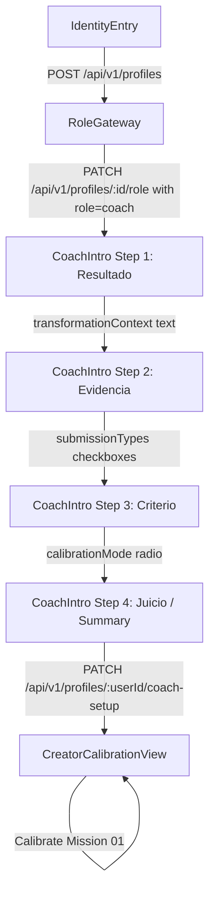
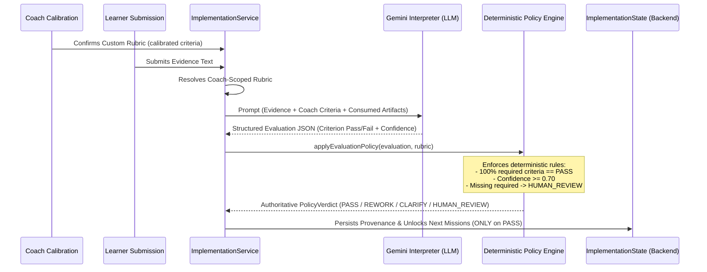
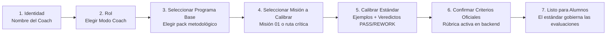

# TRAZO Product V2 — Onboarding & Coach Capability Truth Audit

> **Audit Type:** Read-Only Product & Backend Capabilities Inspection  
> **Date:** August 2026  
> **Target Scope:** Learner Onboarding Data, Coach Flow, Course/Program Creation, Content Ingestion, Methodology Authoring, Criteria & Rubrics, Calibration Service, Evaluation Pipeline, and Learner Management.

---

## 1. Executive Summary & Audit Verdict

TRAZO is built upon a deterministic state-machine and policy-engine backbone with an integrated LLM interpretation layer (Gemini 2.5 Flash via Canonical AI Runtime).

- **Learner Path:** The backend natively supports rich learner setup (`preferredRouteId`, `helpPreference`, `goal`, `availableTime`). However, only `preferredRouteId` and `helpPreference` have consequential downstream logic. `preferredRouteId` visually steers corridor selection and first-run completion; `helpPreference` deterministically adapts feedback tone and injects guidance into the Gemini evaluator prompt. `goal` and `availableTime` are largely dormant.
- **Coach Path:** TRAZO possesses a robust, tested **Calibration Engine** (`CalibrationService`, `CreatorCalibrationView`, `ICalibrationRepository`) that authoritatively controls how Gemini interprets student deliverables. When a coach confirms a rubric, that rubric strictly overrides default criteria for all student evaluations scoped to that coach.
- **Authoring & Ingestion Reality:** There is **zero support for course importing** (PDF, LMS, URLs, pasted curriculum) and **zero UI for graph/curriculum authoring**. The backend supports full graph manipulation via REST (`POST /api/v1/methodologies`), but in the product UI, coaches calibrate existing missions within pre-registered methodology packs (`primer-sistema-de-contenido`, `primer-cliente-digital`).
- **Learner Management Reality:** There is **zero coach management UI** (no student rosters, no invitation flows, no review queues for `HUMAN_REVIEW` cases, no manual evaluation override).

---

## 2. Learner Profile & Onboarding Data Truth Table

| Field | Collected in UI? | Persisted in Backend? | Consumers in Codebase | Downstream Consequence | Status |
| :--- | :--- | :--- | :--- | :--- | :--- |
| **`displayName`** | **YES** (`IdentityEntry.tsx`) | **YES** (`user_profiles` store) | • `HudBar`<br>• `LearnerQuickSetup`<br>• `RoleGateway`<br>• `prompts.ts` (`CompanionProfileContext`) | LLM companion addresses the learner by name; UI displays learner identity. | **Active / Justified** |
| **`role`** | **YES** (`RoleGateway.tsx`) | **YES** (`user_profiles` store) | • `IdentityService.setRole`<br>• `App.tsx` routing<br>• API route auth (`requireRole`) | Automatically provisions a learner implementation workspace (`learner-{userId}`); branches UI between Learner and Coach flows. | **Active / Justified** |
| **`preferredRouteId`** | **YES** (`LearnerQuickSetup.tsx`) | **YES** (`implementations` store -> `state.learnerSetup.preferredRouteId`) | • `App.tsx`<br>• `LearnerRouteReady.tsx`<br>• `QuestMap.tsx`<br>• `autonomyService.ts` | Highlights the chosen branch corridor on the DAG; unlocks the transition from setup to map; passes into autonomy reasoner context. | **Active / Justified** |
| **`helpPreference`** (`DIRECT`, `QUESTIONS`, `EXAMPLE`, `ADAPTIVE`) | **NO** (Not present in `LearnerQuickSetup.tsx`) | **YES** (`state.learnerSetup.helpPreference`) | • `service.ts` (`submitEvidence`)<br>• `domain/learner.ts` (`adaptCompanionGuidance`)<br>• `evaluator/prompts.ts`<br>• `autonomyService.ts` | Injects `HELP PREFERENCE` into Gemini prompt; mutates non-PASS feedback deterministically (e.g. Socratic questions for `QUESTIONS`, concrete rewrite examples for `EXAMPLE`). | **Backend Active / UI Dormant** |
| **`goal`** | **NO** (Not present in `LearnerQuickSetup.tsx`) | **YES** (`state.learnerSetup.goal`, max 300 chars) | • `autonomyService.ts` (injected in `<durable_state>` for background stall detection) | Has no deterministic effect on map, next action, evaluation, or progression. | **Dormant** |
| **`availableTime`** (`15_30_MIN`, `30_60_MIN`, `1_2_HOURS`, `VARIES`) | **NO** (Not present in `LearnerQuickSetup.tsx`) | **YES** (`state.learnerSetup.availableTime`) | • `autonomyService.ts` (injected in `<durable_state>`) | Has no deterministic effect on map, next action, evaluation, or progression. | **Dormant** |

### Learner Questions Justified for Product V2 Onboarding
Only 3 questions have verified downstream product effects:
1. **Name (`displayName`)**: Sets identity and anchors LLM companion personalization.
2. **Role (`role`)**: Directs to Learner or Coach workspace.
3. **Route Focus (`preferredRouteId`)**: In branching chapters, selects the initial delivery corridor on the DAG.
*(Optional 4th question: **Style of Help (`helpPreference`)**, if exposed in UI, since the backend and evaluator already implement distinct guidance adaptation for `QUESTIONS` vs `EXAMPLE` vs `DIRECT`).*

---

## 3. Current Coach Entry Flow & Screens

The active codebase implements the following sequential flow for coaches:



### Exact Current Coach Screens & Components
1. **`IdentityEntry.tsx`**: Captures coach display name.
2. **`RoleGateway.tsx`**: Allows choosing "Coach" (`02B`).
3. **`CoachIntro.tsx`**: 4-step wizard:
   - Step 1: `transformationContext` textarea ("¿Qué cambio quieres provocar?").
   - Step 2: `submissionTypes` multiselect (`text`, `document`, `link`, `image`, `combination`, `other`).
   - Step 3: `calibrationMode` radio (`own_examples`, `generated_examples`, `mixed_examples`).
   - Step 4: Summary step -> submits to `/api/v1/profiles/:userId/coach-setup`.
4. **`CreatorCalibrationView.tsx`**: Calibration interface mounted automatically on the entry mission of the default pack.
5. **End State**: Coach is locked into `CreatorCalibrationView` for mission 1. There is no dashboard, no multi-mission selector, and no student management view.

---

## 4. Course / Program Creation Audit

| Capability | Status | Notes & Repo Evidence |
| :--- | :--- | :--- |
| **Create a program/course** | **BACKEND_ONLY** | `POST /api/v1/methodologies` persists full `MethodologyGraph`. No UI exists to create a new program. |
| **Name it** | **BACKEND_ONLY** | `MethodologyGraph.title` supported in schema and persistence. No UI. |
| **Describe it** | **BACKEND_ONLY** | `MethodologyGraph.description` supported in schema. No UI. |
| **Create chapters** | **DOES_NOT_EXIST** | `MethodologyGraph` represents a single flat graph (adapted to a single chapter). Multi-chapter authoring is `STATIC_FIXTURE_ONLY`. |
| **Create missions (nodes)** | **BACKEND_ONLY** | `MethodologyNode` supports full node creation in JSON API. No UI. |
| **Reorder missions / layout** | **BACKEND_ONLY** | Node positions `position: { x, y }` supported in API. No visual drag-and-drop editor. |
| **Define dependencies (prerequisites)** | **BACKEND_ONLY** | `MethodologyEdge`, `prerequisites`, `requiresAny` validated and persisted via API. No UI. |
| **Define branches** | **BACKEND_ONLY** | Conditional edges and branching rules supported in API. No UI. |
| **Save versions** | **BACKEND_ONLY** | Versioning with SHA-256 canonical hash validation (`validateMethodologyGraph`, `canonicalHash`). No UI. |
| **Publish/activate a methodology** | **BACKEND_ONLY** | `MethodologyGraph.status = 'active' | 'confirmed'` updates active pointer in repository. No UI. |

---

## 5. Course Import & Content Ingestion Audit

| Import Source | Status | Repo Evidence |
| :--- | :--- | :--- |
| **Pasted text curriculum** | **DOES_NOT_EXIST** | No parsing or extraction pipeline exists. |
| **PDF course upload** | **DOES_NOT_EXIST** | No PDF parser, OCR, or file upload endpoint. |
| **Document upload (Word/MD)** | **DOES_NOT_EXIST** | No document ingest endpoint. |
| **URL scraping / web import** | **DOES_NOT_EXIST** | No URL scraper or ingest worker. |
| **LMS import (LearnDash, Thinkific, HighLevel)** | **DOES_NOT_EXIST** | Only referenced as long-term market hypothesis in `PROJECT_HYPOTHESIS.md`. |
| **Structured JSON** | **BACKEND_ONLY** | `POST /api/v1/methodologies` accepts valid `MethodologyGraph` JSON payload. |
| **AI curriculum extraction** | **DOES_NOT_EXIST** | No AI prompt or pipeline to convert unstructured content into a DAG. |
| **Course context ingestion** | **PARTIAL** | `CoachIntro` collects `transformationContext` (max 500 chars) in `UserProfile.coachSetup`, but it is not fed into graph generation. |

---

## 6. Methodology Graph Architecture

The methodology graph engine (`src/domain/methodology.ts`, `src/domain/methodologyRuntime.ts`, `src/domain/methodologyValidation.ts`) is fully implemented with strict mathematical guarantees:
- **DAG Integrity:** Validates cycle-free directed acyclic graphs, single/multiple entry points, and terminal state reachable paths.
- **Nodes (`MethodologyNode`):** Supports `id`, `title`, `nodeType`, `mapRole` (`entry`, `branch`, `checkpoint`, `terminal`), `position`, `description`, `evidenceType`, `evidencePrompt`, `evidenceCriteria`, `producesArtifacts`, `artifactProductions`, `consumesArtifacts`, `prerequisites`, `requiresAny`, `isTerminal`, and `criteriaRef`.
- **Edges (`MethodologyEdge`):** Supports `DEFAULT`, `CONDITIONAL`, `REMEDIATION`, `OPTIONAL`, with decision conditions (`ACCEPT`, `CLARIFY`, `REWORK`, `HUMAN_REVIEW`) and priorities.
- **Canonical Hash:** Computes deterministic SHA-256 hash across sorted nodes and edges to detect stale methodology state.

**Delivery Boundary:** All graph capabilities are operable through backend services and REST APIs, but have **no authoring UI**.

---

## 7. Criteria & Rubrics Core Audit

| Capability | Supported in Backend? | Supported in UI? | Repo Location |
| :--- | :--- | :--- | :--- |
| **Create criteria** | **YES** | **YES** | `CalibrationService.propose` & `CreatorCalibrationView` |
| **Label criteria** | **YES** | **PARTIAL** | `RubricCriterion.label` (UI auto-labels or sets indexed title) |
| **Describe criteria** | **YES** | **YES** | `CreatorCalibrationView` editable text inputs |
| **Set deterministic requirements** | **YES** | **PARTIAL** | Backend enforces `isRequired: true` / `kind: 'hard_requirement'`; UI hardcodes required criteria. |
| **Provide guidance / instructions** | **YES** | **STATIC** | Backend stores `Rubric.systemInstructions`; UI uses default template. |
| **Create examples (positive)** | **YES** | **YES** | `CreatorCalibrationView` "Pega o redacta un ejemplo real" -> judged `PASS` |
| **Create counterexamples (negative)** | **YES** | **YES** | `CreatorCalibrationView` judged `REWORK` with required `reason` |
| **Edit rubrics** | **YES** | **YES** | Direct text editing of criteria in `CreatorCalibrationView` |
| **Version rubrics** | **YES** | **YES (Automated)** | Version increment on confirmation (`1.0.0` -> `1.1.0`), versioned storage keys |

---

## 8. Calibration Engine Deep Dive

### Plain-Language Product Explanation
The Calibration feature allows a coach to **teach TRAZO their evaluation standard for a specific mission** without writing complex AI system prompts.

1. **Coach Input:**
   - **Initial Standard:** Free text describing what a good submission must contain.
   - **Examples:** Real submissions pasted by the coach, or 3 synthetic edge-case submissions generated by TRAZO (`clear_pass`, `clear_rework`, `borderline`).
   - **Judgments & Reasons:** For each submission, the coach selects `PASS`, `REWORK`, or `CLARIFY` and provides a mandatory explanation of *why*.
   - **Criteria Refinement:** The coach reviews and edits the generated criteria descriptions.
2. **System Computation:**
   - Splits the coach's standard into individual criteria clauses.
   - Synthesizes synthetic submissions for the specific mission prompt.
   - Packages criteria into a structured, versioned `Rubric` object.
   - Validates that mission hard requirements are preserved (`validateCriteriaStructure`).
3. **Persistence:**
   - Persists a `CreatorCalibration` record in `creator_calibrations` store with status `confirmed`, linking `coachId`, `courseId`, `missionId`, and `version`.
4. **Product Effect on Learner Evaluation:**
   - **Direct & Authoritative:** When a student belonging to this coach submits evidence for this mission, `service.ts` retrieves the coach's active confirmed rubric.
   - Gemini evaluates the evidence **strictly against the coach's criteria**.
   - The deterministic policy engine requires **100% of the coach's required criteria to be PASS**; otherwise, the student receives `REWORK` or `CLARIFY` with actionable feedback.

---

## 9. Evaluation Pipeline & Coach Control Boundaries



### What the Coach Controls
- Number and descriptions of evaluation criteria.
- Which criteria are mandatory vs optional signals.
- Examples and counter-examples that define the boundaries.

### What the Coach Cannot Bypass (Deterministic Invariants)
- **Zero Hallucination of Pass:** An LLM recommendation cannot bypass failing criteria.
- **Fail-Closed Threshold:** If confidence drops below `0.70`, the policy forces `HUMAN_REVIEW`.
- **Hard Prerequisite Guard:** A coach cannot confirm a rubric that eliminates the mission's base structural requirements.

---

## 10. Coach Management & Learner Tracking Audit

| Capability | Status | Repo Evidence |
| :--- | :--- | :--- |
| **Invite learner** | **DOES_NOT_EXIST** | No invitation system, invite codes, or email dispatch. |
| **Assign program to learner** | **BACKEND_ONLY** | `POST /api/v1/implementations` accepts `{ courseId, coachId, userId }`. No UI. |
| **See learner list / roster** | **DOES_NOT_EXIST** | No coach-facing student list endpoint or component. |
| **See learner progress on map** | **DOES_NOT_EXIST** | Map currently only renders the active learner's own state. |
| **Inspect student evidence** | **DOES_NOT_EXIST** | Evidence provenance is stored in `ImplementationState`, but no coach viewer exists. |
| **Inspect student evaluations** | **DOES_NOT_EXIST** | No coach audit view. |
| **Intervene manually / override grade** | **DOES_NOT_EXIST** | Evaluation verdicts are strictly generated by the evaluator pipeline. |
| **View HUMAN_REVIEW queue** | **DOES_NOT_EXIST** | `HUMAN_REVIEW` verdicts are recorded in state provenance, but no queue UI exists. |
| **View autonomy interventions** | **BACKEND_ONLY** | Audited in `IAutonomyAuditRepository` (`autonomy_audits` store), but no UI exists. |

---

## 11. Product Gap Map

```
========================================================================================
ALREADY EXISTS — NEEDS UI
========================================================================================
• Multi-Mission Calibration Selector: Backend supports calibrating any mission in any pack;
  UI is currently hardcoded to mission 01 of the default pack.
• Help Preference Onboarding Question: Backend & evaluator fully implement guidance
  adaptation ('QUESTIONS', 'EXAMPLE', 'DIRECT'); UI does not ask the question.
• Coach Methodology Resolution: Backend dynamically resolves custom methodology graphs
  for coach-scoped implementations; UI only mounts static packs.
• Autonomy & Escalation Logs: Backend records every autonomy intervention and escalation
  in durable repositories; no UI exists to inspect them.

========================================================================================
UI EXISTS — NEEDS POLISH
========================================================================================
• CreatorCalibrationView: Functional and complete for single missions; needs smoother
  navigation between missions and clearer visual confirmation badges.
• CoachIntro: 4-step wizard is functional; step 1 text (transformation context) should
  be connected to course metadata or calibration prompts.
• LearnerQuickSetup & LearnerRouteReady: Clean and functional; correctly saves preferredRouteId.

========================================================================================
BACKEND EXISTS — NO UI
========================================================================================
• Methodology Graph Authoring API: POST /api/v1/methodologies can save nodes, edges,
  conditions, artifacts, and canonical hashes; zero frontend builder exists.
• Implementation Provisioning for Coach: Backend allows creating implementations with
  specific coachId; no UI for coaches to assign courses to students.
• Rubric Version History: Repository stores version history of confirmed rubrics; no UI
  to inspect or roll back past versions.

========================================================================================
PARTIAL
========================================================================================
• Criteria Customization: Coaches can edit criteria text and confirm, but cannot toggle
  optional quality signals vs hard requirements from the UI.
• Multi-Pack Support: 2 static packs exist in repo (Content System, First Client); UI
  switching is limited to URL query parameter (?metodologia=).

========================================================================================
MISSING (DOES NOT EXIST TODAY)
========================================================================================
• Course / Curriculum Import (PDF, LMS, Web Scraping, Paste Text).
• Visual DAG / Graph Builder UI (creating nodes, dragging edges).
• Coach Student Management Dashboard (student rosters, progress tracking, evidence viewer).
• Coach Review Queue for HUMAN_REVIEW cases.
• Learner Invitation System (links, tokens, sign-up invites).
========================================================================================
```

---

## 12. Minimum Honest Coach Onboarding Proposal

Based strictly on existing, working backend capabilities, the smallest honest Coach Onboarding is:



### Prohibited Promises in Coach Onboarding
- ❌ Do NOT include "Upload your course / Subir PDF / Importar LMS".
- ❌ Do NOT include "Diseña tu plan de estudios desde cero" (until graph builder UI is built).
- ❌ Do NOT include "Invita a tus alumnos por correo" (until invite system exists).

---

## 13. Recommended Next UI Build

1. **Expose `helpPreference` in Learner Onboarding:**
   Add a simple 3-card choice in `LearnerQuickSetup` ("¿Cómo prefieres que TRAZO te oriente cuando una entrega no alcance el estándar?": *Preguntas socráticas*, *Ejemplos concretos*, *Instrucciones directas*). This immediately activates dormant backend logic and creates noticeable pedagogical personalization.
2. **Multi-Mission Calibration Selector for Coach:**
   Upgrade `CreatorCalibrationView` from a single hardcoded mission view into a mission navigator where the coach can click through all missions of the selected pack, see which missions have confirmed criteria, and calibrate the rest.
3. **Mission Rubric Inspector in Learner View:**
   Allow learners in `MissionPanel` to view the active coach-confirmed criteria checklist before submitting evidence.
